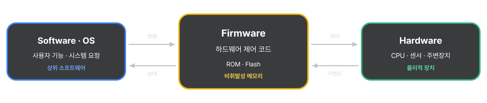
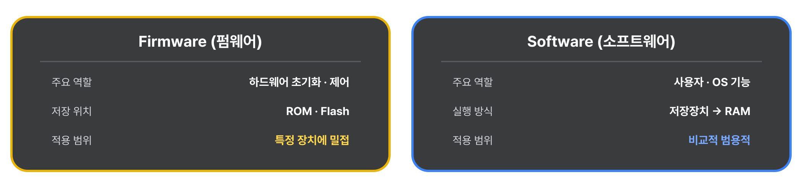
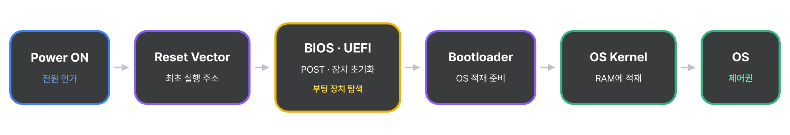
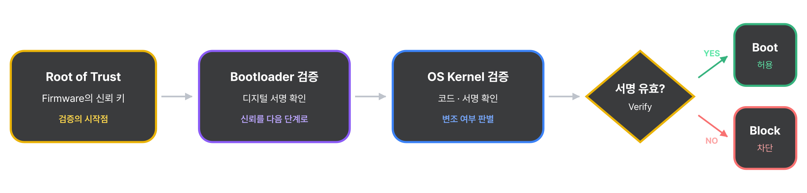
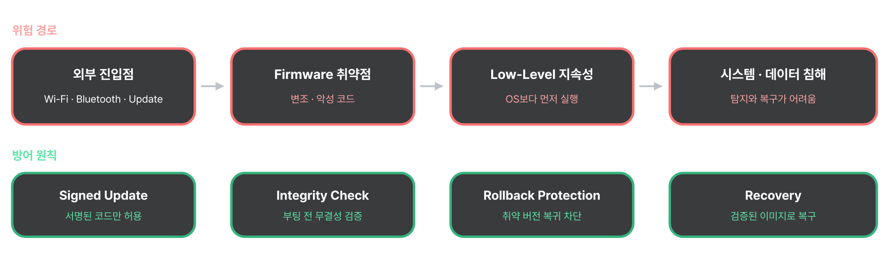
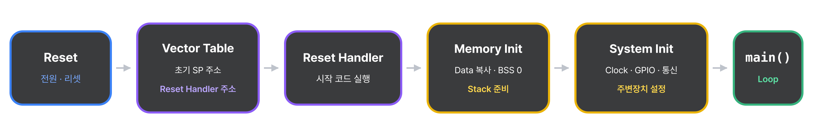
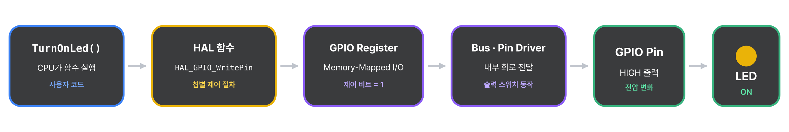
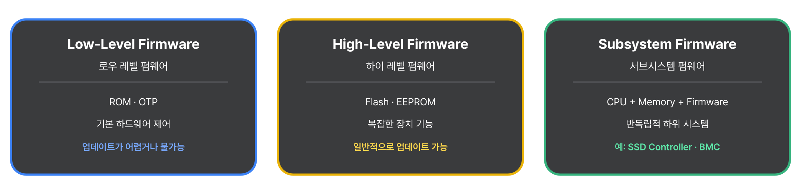

<sub><a href="../../../">MyPage_</a> / <a href="../../">00 . System Overview (시스템 전체 흐름)</a> / <a href="../">System Components (시스템 구성 요소)</a></sub>

# Firmware (펌웨어)

<sub>SYSTEM COMPONENTS (시스템 구성 요소) · 2026.09.09</sub>


## 펌웨어란 무엇인가?



**‘하드웨어용 소프트웨어’**라고도 하는 펌웨어는 하드웨어 장치에 내장된 프로그램 코드로, 하드웨어 장치와 그 기능이 제대로 작동할 수 있도록 한다.

펌웨어는 일반적인 문제를 해결하고, 기능을 추가 또는 확장하거나, 새로운 기술과 장치의 호환성을 높이기 위해 정기적으로 업데이트된다.

TV, 카메라, 휴대폰, 프린터, 드라이브 등을 포함한 많은 장치가 펌웨어에 의존하여 작동한다.

펌웨어는 디바이스의 비휘발성 메모리에 위치하며, 디바이스가 꺼져있을 때 콘텐츠를 저장할 수 있다.

펌웨어는 랜덤 엑세스 메모리(RAM), 읽기 전용 메모리(ROM), 삭제 가능한 프로그래밍 가능한 읽기 전용 메모리(EPROM) 및 플래시 메모리를 비롯한 다양한 메모리 유형에 기록이 가능하다.

---

### 펌웨어 (Firmware) vs 소프트웨어 (Software)



펌웨어 (Firmware)는 하드웨어를 직접 제어하고 구동하기 위해 물리적 장치에 내장된 Low-Level 명령어 집합이다.

소프트웨어 (Software)는 사용자가 기기를 활요해 다양한 작업을 수행할 수 있도록 돕는 응용 프로그램이나 운영체제를 뜻한다.

펌웨어와 소프트웨어는 모두 명령어로 이루어져 비슷해 보이지만 몇 가지 차이점이 존재한다.

#### 펌웨어 (Firmware)

- 역할과 목적
  - 펌웨어는 하드웨어를 초기화하고 부팅시키며, 하드웨어 간의 상호작용을 돕는 **‘하드웨어를 위한 제어 지침’**이다.
- 저장 위치
  - 펌웨어는 주로 읽기 전용 메모리(ROM)이나 플래시 메모리 등 비휘발성(전원이 꺼져도 지워지지 않는) 메모리에 고정되어 저장된다.
- 업데이트 빈도
  - 펌웨어는 하드웨어 오작동 방지나 보안 강화를 위해 드물게 업데이트된다.
- 범용성과 독립성
  - 펌웨어는 특정 하드웨어 부품(예: Bluetooth 칩, 특정 프린터 기종)에 전용으로 설계되어 호환성이 낮다.

#### 소프트웨어 (Software)

- 역할과 목적
  - 소프트웨어는 문서 작성, 인터넷 검색, 앱 실행 등 사용자가 직접 상호작용하고 목적을 달성하는 ‘사용자를 위한 프로그램’이다.
- 저장 위치
  - 소프트웨어는 주로 하드디스크, SSD, RAM 등 일곡 쓰기가 자유로운 저장 장치에 설치되어 실행된다.
- 업데이트 빈도
  - 소프트웨어는 기능 추가와 버그 수정을 위해 상시적이고 자주 업데이트된다.
- 범용성과 독립성
  - 소프트웨어는 표준 규격만 맞으면 다양한 기기에서 비교적 유연하게 작동할 수 있다.

---

## 펌웨어가 왜 중요한가?

### 완전히 꺼진 상태에서 시작 (하드웨어 리셋)



Cold Boot(컴퓨터 구조에서 전원이 켜지는 순간)시,  메인 메모리(RAM)와 CPU커널은 아무 데이터도 없는 전자기적 공백 상태다.  상위 레벨의 운영체제(OS)는 스스로 실행될수 없다.

- 하드웨어 무결성 검증 (POST)
  - 전원이 들어오면 CPU는 미리 지정된 하드웨어 주소(Reset Vector)에 있는 펌웨어(BIOS/UEFI 등)를 가장 먼저 실행한다.
  - 펌웨어는 RAM, GPU, 칩셋 들이 물리적으로 안전하게 연결되었는지 검사한다.
- OS 커널 적재
  - 검증이 끝나면 펌웨어는 SSD나 HDD 같은 저장장치의 특정 섹터에서 OS의 핵심(Kernel)을 찾아내 RAM에 복사하고, CPU의 제어권을 OS(운영체제)에게 넘겨준다.
  - 최초의 Bootstrapping은 오직 하드웨어에 고정된 펌웨어만 수행할 수 있다.

### 마이크로초(µs) 단위의 실시간 제어와 물리적 신뢰성 보장

운영체제(OS)가 탑재된 소프트웨어 환경은 여러 프로그램을 동시에 돌리기 위해 CPU 자원을 분할 (Scheduling)하므로, 명령어 처리 시간에 수 밀리초(ms) 단위에 미세한 Latency(지연)과 오차가 늘 발생한다.

- 실시간성(Real-Time) 달성
  - 자동차의 ABS(브레이크 잠김 방지), 에어백, 자동화 로봇 등은 0.001초의 지연도 허용되지 않는다. <br>그렇기에 펌웨어는 상위 OS나 추상화 계층을 거치지지 않고, 하드웨어 내부 레지스터의 비트 (Bit)를 직접 쪼개고 제어하므로 지연 시간이 거의 제로에 가까운 물리적 즉각성을 보장한다.
- 하드웨어 인터럽트 (Interrupt) 최우선 처리
  - 센서나 하드웨어에서 위험 신호(인터럽트)가 들어오는 즉시,<br>펌웨어는 하드웨어 수준에서 이를 가로채 최우선으로 구동시킨다.

### 시스템 전체 보안의 뿌리 (Root of Trust)



컴퓨터 보안 구조에서 가장 밑바닥에 위치하여 위 단계의 모든 소프트웨어를 검증하는 기점을 ‘Root of Trust’(신뢰의 기점)이라고 부르며, 이 핵심을 펌웨어가 담당한다.

- Secure Boot (보안 부팅)
  - 최신 펌웨어는 OS가 켜지기 전, 부팅하려는 OS 커널과 드라이버의 암호화 디지털 서명을 하드웨어 수준에서 검증한다.
  - 만약 악성코드에 의해 OS가 위변조되었다면 시동 자체를 차단한다.
  - 실제로 [Google, Pixel 펌웨어 보안 결함이 제로데이로 악용될 수 있다고 경고](https://thehackernews.com/2024/06/google-warns-of-pixel-firmware-security.html) 하기도 했다.
- 하위 계층 방어
  - OS 단계의 백신 프로그램은 OS가 켜지기도 전에 메모리를 장악하는 하드웨어 수준의 해킹(Bootkit, Rootkit)을 절대 감지할 수 없다.
  - 펌웨어가 견고해야만 그 위에 올라가는 OS와 앱 보안도 의미가 있다.

### 물리적 하드웨어의 생명 연장 (유연성과 비용 절감)

실리콘 칩(IC)은 공장에서 한 번 찍어내면 내부의 물리적 회로 구조를 바꾸는 것이 불가능하다.

하지만 펌웨어가 있기에 하드웨어는 출시 이후에도 발전할 수 있다.

- 소프트웨어적 회로 보완
  - 새로운 문선 통신 보안 규격이 도입되거나, 하드웨어 자체의 설계 결함(버그)이 발견되었을 때, 억 단위의 비용을 들여 칩을 다시 만들 필요가 없다. 비휘발성 메모리에 써진 펌웨어 코드를 덮어쓰는(Flash Writing) 것만으로 칩의 물리적 동작 방식을 수정할 수 있다.
  - 예시
    - 구현 메인보드가 수년 뒤에 출시된 최신 세대의 CPU를 물리적으로 인식하고 전압을 맞출 수 있게 구조적 호환성을 열어주는 것이 바로 메인보드 펌웨어(BIOS) 업데이트다.

---

## 펌웨어 보안



펌웨어는 매우 널리 사용되고 많은 중요한 장치의 기능에 필수적인 요소이기에 해커의 중요한 표적이 되었다.

펌웨어에 의존하는 하드웨어 장치는 동일한 코드를 자주 사용하기 때문에 많은 취약점을 갖고 있다.

예를 들어, 민감한 작업 정보가 포함된 노트북은 펌웨어를 사용하여 베터리, 사운드 및 비디오 카드, 웹캠 등에 전원을 공급하므로 매력적인 표적이 된다.

펌웨어 해킹에는 펌웨어에 부착하여 컴퓨터 시스템이나 사용자에게 해를 끼치기 위해 의도적으로 작성된 코드인 “멜웨어”의 배포가 포함되는 경우가 많다.

맬웨어 유형으로는 사용자의 데이터를 인질로 잡는 랜섬웨어, 합법적인 프로그램으로 가장하여 탐지를 회피하는 트로이 목마, 사용자에 대한 민감한 정보를 훔치는 스파이웨어 등이 있다.

해커는 악용하기 위해 시스템에 물리적으로 접근할 필요가 거의 없으며 Bluetooth 또는 Wi-Fi 연결을 사용하여 원격으로 엑세스할 수 있으며, 이는 인터넷 연결이 가능한 장치의 수가 증가함에 따라 점점 더 심해지고 있다.

펌웨어 보안 기능이 좋지 않으면 민감한 사용자 데이터가 도난당하거나 손상될 수 있으며 악의적인 행위자가 사용자 시스템을 원경으로 제어할 수 있다.

2024년 6월 Google은 Pixel 펌웨어의 문제로 인해 기기가 공격자에게 취약해졌으며, 해당 문제에 대한 알려진 해결책이 없다는 경고를 발표한적이 있다.

---

## 펌웨어의 이점

- 새로운 하드웨어 없이도 성능 향상
  - 펌웨어 업데이트를 통해 디바이스나 아키텍처를 변경하지 않고도 새로운 기능과 성능을 구현할 수 있다.
- 사용자 경험 개선
  - 펌웨어 업데이트는 IoT 기능을 통해 세탁기 또는 여러가지 가전가구와 연동하여 사용할 수 있다.
- 더 빠른 문제 해결
  - 펌웨어 업데이트를 통해 부팅 및 처리 시간, 더 많은 멀티태스킹 기능, 외부 장치와의 더 나은 호환성 등 장치와 관련된 많은 일반적인 문제를 신속하게 해결한다.
- 구성 요소 기능
  - 펌웨어 업데이트는 스마트폰의 스피커 및 마이크와 같은 장치의 모든 주변 구성 요소가 설계된 방식으로 작동하도록 하여 장치가 최상의 상태에서 작동할 수 있도록 한다.

---

## 펌웨어의 작동방식

### 부팅 및 초기화 (Power-on & initializtion)



하드웨어에 전원이 공급되면 프로세서(MCU/CPU)는 가장 먼저 고정된 특정 메모리 주소(Reset Vector)를 가리킨다. 이 주소에 바로 펌웨어의 시작 코드가 위치하게된다.

- 인터럽트 벡터 테이블(IVT) 설정
  - 하드웨어 이벤트(인터럽트)가 발생했을 때 처리할 함수의 주소록을 메모리에 등록한다.
- 레지스터 및 주변장치(Peripherals)초기화
  - CPU의 동작 속도(Clock)속도를 설정하고, GPIO(입출력 핀)과 통신 포트를 사용할 수 있도록 초기 상태를 만든다.
- 메모리 준비
  - C/C++ 언어가 동작할 수 있도록 임시 데이터가 저장될 메모리(RAM) 영역(스택 및 데이터 영역)을 세팅한다.

---

### 펌웨어가 하드웨어를 제어하는 과정



펌웨어는 CPU가 실행하는 프로그램이며, 하드웨어의 제어 레지스터에 값을 읽고 쓰면서 장치를 제어한다. LED를 켜는 상황을 예로 들면 다음과 같이 동작한다.

#### 1. CPU의 펌웨어 실행

작성한 펌웨어 코드는 컴파일과 링크를 거쳐 실행 가능한 형태로 만들어지고, 마이크로컨트롤러의 플래시 메모리에 저장된다.

CPU는 저장된 명령어를 실행하며 초기 설정을 수행하고, 프로그램에 작성된 순서에 따라 하드웨어를 제어한다.

이 과정에서 LED를 켜는 코드에 도달하면, 해당 제어 함수가 실행된다.

#### 2. HAL 함수를 통한 제어

개발자는 하드웨어를 제어할 때 **HAL(Hardware Abstraction Layer, 하드웨어 추상화 계층)**이 제공하는 함수를 사용할 수 있다.

HAL은 칩마다 다른 레지스터 접근 방법과 설정 절차를 함수로 제공한다.

개발자는 이 함수를 이용해 원하는 동작을 코드로 표현한다.

다음은 **STM32 HAL**을 사용한 예시다. LED가 연결된 핀은 출력으로 초기화되어 있고, 출력이 HIGH일 때 LED가 켜지는 회로라고 가정한다.

```c
void TurnOnLed(void) {
    HAL_GPIO_WritePin(LED_GPIO_Port, LED_Pin, GPIO_PIN_SET);
}
```

CPU가 `TurnOnLed()`를 실행하면, 그 안에서 호출한 HAL 함수의 코드도 실행한다. 이 HAL 함수 내부에는 **해당 GPIO 레지스터에 값을 쓰는 코드**가 들어 있다. [ST 공식 HAL 구현](https://github.com/STMicroelectronics/stm32f1xx-hal-driver/blob/master/Src/stm32f1xx_hal_gpio.c)

#### 3. 레지스터에 제어 값 기록

**그렇다면 HAL 함수는 하드웨어의 어디에 값을 쓰는 것일까?**

칩 제조사는 하드웨어를 제어하거나 상태를 확인할 수 있는 **레지스터**를 만들고, 각 레지스터에 접근할 주소와 비트의 의미를 정해 둔다.

예를 들어 GPIO에는 핀의 입출력 모드를 설정하는 레지스터, 출력 상태를 변경하는 레지스터 등이 있다. 하나의 레지스터에서 여러 핀을 비트별로 다루기도 한다. 이러한 주소와 구조는 보통 제조사가 제공하는 헤더 파일에 정의되어 있다. [ST 공식 레지스터 정의](https://github.com/STMicroelectronics/cmsis-device-f1/blob/master/Include/stm32f103xb.h)

C 코드에서는 포인터를 이용해 해당 주소에 접근한다. 이때 `volatile`은 레지스터 읽기·쓰기가 불필요한 접근으로 판단되어 최적화로 생략되지 않도록 하는 데 사용된다. [GCC 문서](https://gcc.gnu.org/onlinedocs/gcc/Volatiles.html)

즉, **제조사가 정한 하드웨어 접근 규칙을 HAL 코드가 구현하고, CPU가 그 코드를 실행해 레지스터에 값을 쓰는 것이다.**

#### 4. 하드웨어 회로의 반응

작성한 펌웨어 코드가 컴파일되어 칩 내부의 플래시 메모리에 저장된 후, CPU가 이 코드를 실행하면 다음과 같은 하드웨어적 연쇄 반응이 일어납니다.

**함수 실행**

CPU가 `TurnOnLed()` 함수 코드를 읽고 실행합니다.

**전기적 신호 발생**

CPU가 칩 내부의 데이터 통로(Bus)를 통해 `0x40021018` 번지 위치에 있는 메모리 셀(레지스터)에 전류를 보내 비트 값을 `1`로 바꿉니다.

**스위치 작동**

이 `0x40021018` 번지 메모리 셀은 물리적인 전선(미세 회로)을 통해 외부 핀과 연결된 트랜지스터(스위치) 구동부와 이어져 있습니다. 비트가 `1`이 되는 순간 스위치 게이트가 열립니다.

**물리적 출력**

칩의 특정 핀(Pin)으로 3.3V 전압이 출력되면서, 회로기판에 연결된 LED가 물리적으로 켜집니다.

---

## 펌웨어 유형



펌웨어가 메모리를 사용하고 저장하는 방식의 변화 외에도 사용자가 사용할 수 있는 펌웨어 유형도 발전했다.

오늘날 펌웨어는 아키텍처에 따라 정의된 세가지 기본 그룹으로 분류할 수 있다.

- 로우 레벨 펌웨어
- 높은 수준의 펌웨어
- 서브시스템 펌웨어

### 로우 레벨 펌웨어

로우 레벨 펌웨어는 장치의 하드웨어에 내제되어있으며, 업데이트할 수 없는 ROM과같은 비 휘발성 읽기 전용 칩에 저장된다.

로우 레벨 펌웨어에 의존하는 장치는 한 번만 쓸 수 있고 다시 프로그래밍할 수 없는 메모리를 사용한다.

(펌웨어를 메모리에 한 번 기록하면, 이후에는 내용을 바꾸지 못하고 계속 읽어서 실행한다는 뜻이다.)

### 하이 레벨 펌웨어

하이 레벨 펌웨어는 하드웨어의 복잡성으로 인해 업데이트(update)할 수 없는 펌웨어다.

컴퓨터에서 하이 레벨 펌웨어는 플래시 메모리 칩에 포함되어있으며, 로우 레벨 펌웨어보다 더 고급 작업을 담당한다.

하이 레벨 펌웨어에는 디바이스가 작동하는 방식과 다양한 구성 요소가 상호 작용하는 방식에 대한 중요한 지침이 포함되어있다.

### 서브시스템 펌웨어

서브시스템 펌웨어는 목적이나 작업을 위해 설계된 하드웨어와 소프트웨어의 특정 조합인 ‘임베디드 시스템’으로 알려진 것에 포함되어 있다.

서브시스템 펌웨어는 복잡성과 적응성 면에서 하이 레벨 펌웨어와 유사하며, 하이 레벨 펌웨어와 마찬가지로 서브시스템 펌웨어도 쉽게 업데이트가 가능하다.

---

[← Back to System Components (시스템 구성 요소로 돌아가기)](../) · [MyPage_](../../../)
