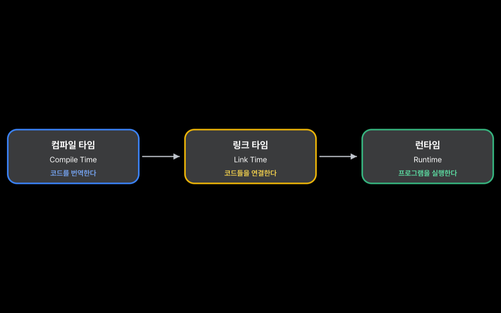
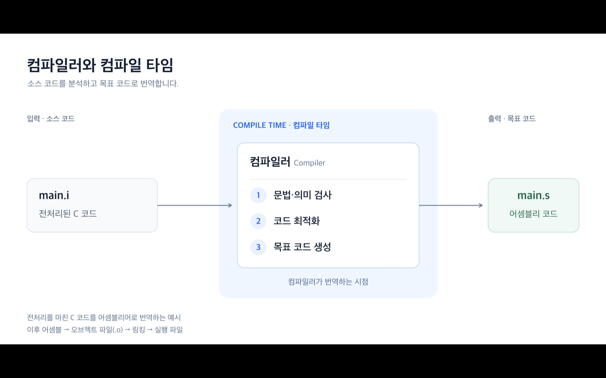
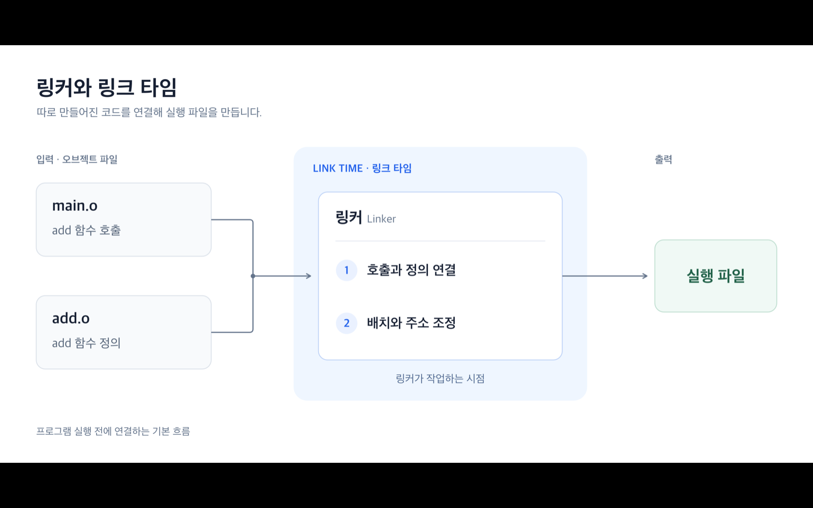
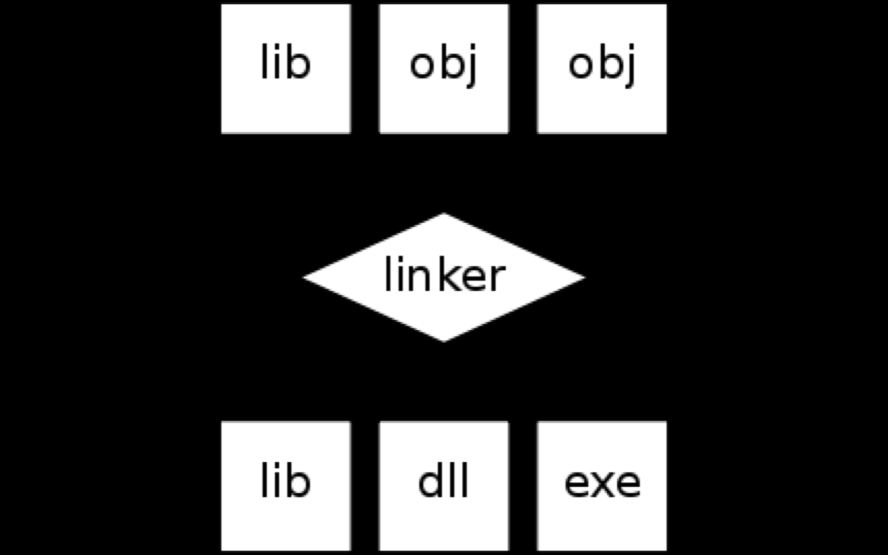
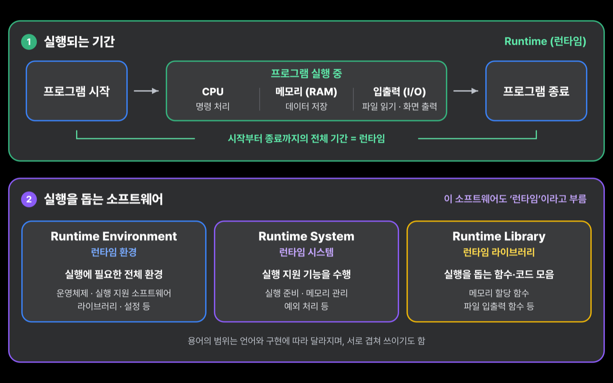
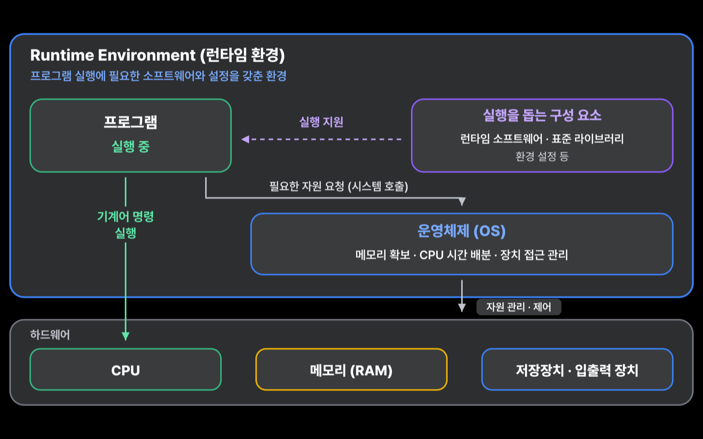
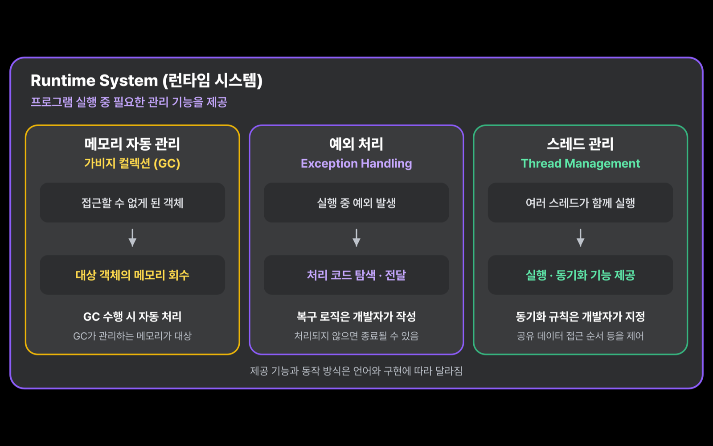
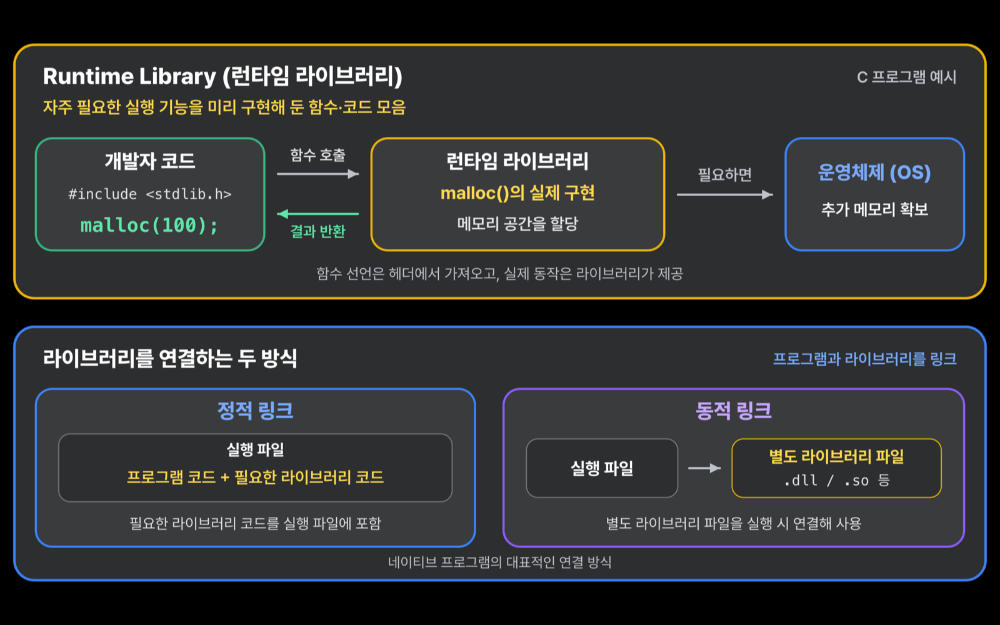
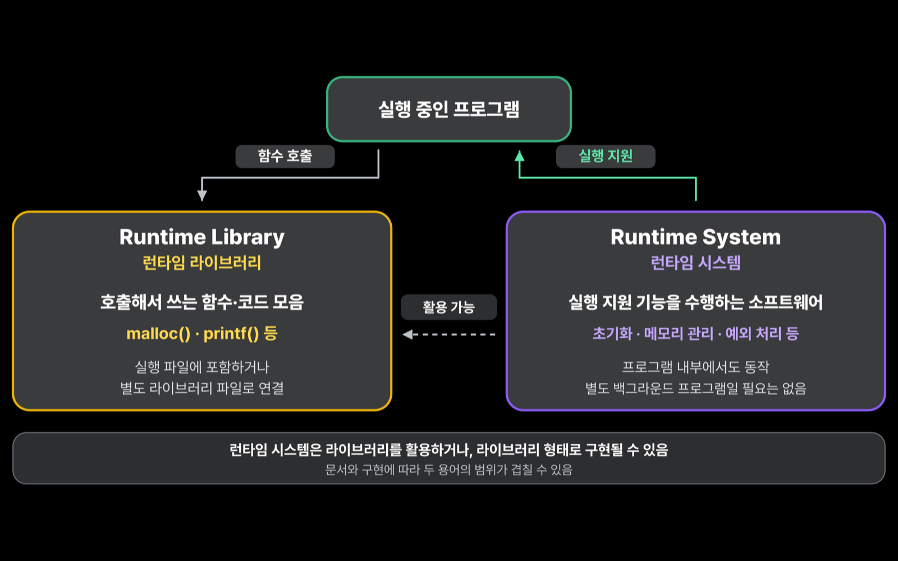
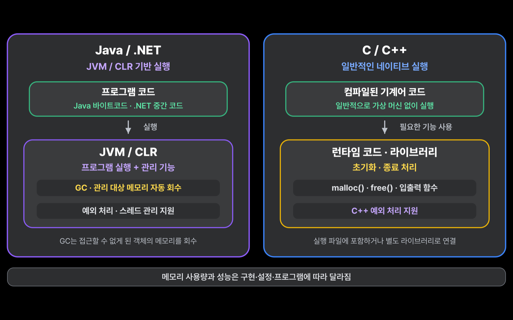

<a href="../../../">MyPage_</a> / <a href="../../">00 . System Overview (시스템 전체 흐름)</a> / <a href="../">System Components (시스템 구성 요소)</a>

# Runtime (런타임)

SYSTEM COMPONENTS (시스템 구성 요소) · 2026.09.07

## Runtime Concepts 런타임 개념

런타임이 언제 발생하는지 이해하려면 프로그램이 만들어지고 실행되는 흐름을 먼저 살펴봐야 한다.

> 코드를 번역한다(Compile Time) → 코드들을 연결한다(Link Time) → 프로그램을 실행한다(Runtime)

이 글에서는 완성된 프로그램이 실행되는 동안 런타임이 어떻게 동작하고 어떤 환경을 구성하는지 정리한다.

---

## Compile Time 컴파일 타임

컴파일 과정이 이루어지는 시점을 컴파일 타임(Compile Time)이라고 한다.

### Compile 컴파일이란?

컴파일은 사람이 작성한 소스 코드를 컴퓨터가 처리할 수 있는 목적 코드로 번역하는 과정이다. 일반적으로 각 소스 파일을 개별적으로 컴파일하고 어셈블하여 오브젝트 파일을 만든다.

컴파일과 인터프리테이션의 차이, AOT와 JIT는 [Compilation & Interpretation (컴파일과 해석)](../../02-program-execution-flow/compilation-interpretation/)에서 더 자세히 정리했다.

---

## Link Time 링크 타임

링커(Linker)가 작동하는 시점을 링크 타임(Link Time)이라고 한다.

### Linker 링커란?

링커는 컴파일러가 만든 하나 이상의 오브젝트 파일과 라이브러리를 결합하여 하나의 실행 가능한 프로그램을 만드는 도구다.

프로그램은 일반적으로 여러 모듈로 이루어진다. 컴파일 과정에서는 각 소스 파일을 개별적으로 컴파일·어셈블하여 오브젝트 파일을 만든다.

C 프로그램을 예로 들어 `main.o`가 `add` 함수를 호출하지만 그 정의를 가지고 있지 않다고 해보자. 링커는 전달받은 오브젝트 파일과 라이브러리에서 `add`의 정의를 찾는다. 이 예에서는 `add.o`에 정의가 들어 있다.

링커는 함수와 변수의 이름인 **심볼(Symbol)**을 기준으로 필요한 코드와 정의를 연결하고 주소를 조정한다. 링커가 수행하는 세부 작업은 별도의 글에서 더 자세히 알아볼 예정이다.

---

## Runtime 런타임

런타임(Runtime)은 프로그램이 실행을 시작한 순간부터 종료될 때까지의 기간이다.

이 동안 프로그램은 CPU에서 명령을 처리하고, 메모리(RAM)에 데이터를 저장하며, 파일을 읽거나 화면에 결과를 출력한다. 컴파일이 코드를 번역하고 링크가 필요한 코드들을 연결하는 과정이라면, 런타임은 프로그램이 실제로 동작하는 시간이다.

프로그램이 동작하려면 메모리를 확보하고, 함수를 호출하고, 실행 중 발생한 예외를 처리하는 등의 지원이 필요하다. 이러한 실행을 돕는 소프트웨어도 런타임이라고 부른다.

| 용어 | 의미 |
| --- | --- |
| Runtime Environment (런타임 환경) | 프로그램이 실행될 수 있도록 갖춰진 전체 환경. 운영체제, 실행 지원 소프트웨어, 라이브러리, 설정 등이 포함된다. |
| Runtime System (런타임 시스템) | 프로그램의 실행을 실제로 돕는 소프트웨어. 구현에 따라 실행 준비, 메모리 관리, 예외 처리 등을 담당한다. |
| Runtime Library (런타임 라이브러리) | 프로그램이 실행 중 사용할 수 있도록 미리 만들어 둔 지원 함수와 코드의 모음. 메모리 할당이나 파일 입출력 함수 등이 해당한다. |

---

## Runtime Environment 런타임 환경

컴파일이 끝난 실행 파일을 메모리에 올리는 것만으로 모든 준비가 끝나는 것은 아니다. 기계어 코드가 하드웨어 위에서 정상적으로 실행되려면 운영체제, 라이브러리, 환경 설정과 같은 기반이 필요하다. 이를 런타임 환경이라고 한다.

프로그램이 시작하고 동작하는 데 필요한 운영체제의 기능, 환경 설정, 표준 라이브러리와 실행 지원 소프트웨어까지 포함한 전체 묶음으로 이해할 수 있다.

### 왜 런타임 환경이 필요한가?

프로그램이 실행된다는 것은 컴퓨터의 메모리를 나누어 쓰고, CPU 시간을 사용하며, 하드웨어와 계속 상호작용한다는 뜻이다.

운영체제는 보안과 안정성을 위해 일반 프로그램이 하드웨어를 직접 제어하지 못하도록 제한한다. 프로그램은 운영체제가 제공하는 인터페이스와 시스템 콜을 통해 필요한 자원을 요청한다.

런타임 환경은 이 위에서 프로그램이 사용할 라이브러리와 설정, 실행 지원 기능을 제공한다. 이러한 기반이 없다면 프로그램은 필요한 메모리와 CPU 자원을 사용할 수 없으므로 정상적으로 실행될 수 없다.

---

## Runtime System 런타임 시스템

개발자가 작성한 코드를 컴파일하고 실행 파일을 시작하면 수많은 관리 작업과 예외 상황이 실시간으로 발생한다. 언어와 구현에 따라 런타임 시스템은 다음과 같은 작업을 담당한다.

- **메모리 자동 관리(Garbage Collection)**: 더 이상 사용하지 않는 메모리를 추적하여 자동으로 회수한다.
- **예외 처리(Exception Handling)**: 파일 누락이나 네트워크 단선처럼 실행 중 발생한 예외를 정해진 방식으로 전달하고 처리한다.
- **스레드 관리(Thread Management)**: 멀티스레드 환경에서 작업이 충돌하거나 순서가 뒤엉키지 않도록 동기화와 스케줄링을 지원한다.

개발자가 모든 관리 기능을 직접 구현하지 않아도 프로그램이 실행되는 동안 런타임 시스템이 필요한 작업을 수행한다. 다만 실제로 제공되는 기능의 범위는 언어와 런타임 구현마다 다르다.

---

## Runtime Library 런타임 라이브러리

개발할 때 사용하는 언어는 대부분 사람이 이해하기 쉬운 고수준 언어다. 하지만 하드웨어는 기계어 명령만 실행한다.

개발자가 고수준 언어로 `print("Hello, world")`를 작성했다고 해서 하드웨어가 곧바로 화면에 문자를 표시하는 것은 아니다. 화면 출력이나 메모리 할당 같은 작업은 운영체제 커널이 제공하는 기능과 연결되어야 한다.

이 복잡한 과정을 개발자가 매번 직접 구현하지 않도록, 컴파일러와 운영체제 환경에 맞춘 저수준 지원 기능을 미리 모아 둔 것이 런타임 라이브러리다.

### 작동하는 방식

개발자가 메모리 할당 함수를 호출했다고 해보자. 코드에는 하드웨어와 운영체제를 직접 제어하는 저수준 구현이 들어 있지 않다.

컴파일러와 링커는 런타임 라이브러리에 있는 메모리 할당 구현을 정적 또는 동적 방식으로 프로그램과 연결한다. 그래서 개발자는 저수준 구현을 매번 새로 작성하지 않고 언어와 라이브러리가 제공하는 함수를 사용할 수 있다.

### 왜 특정 OS와 컴파일러에 의존적인가?

런타임 라이브러리는 메모리 관리와 파일 입출력처럼 시스템과 직접 맞닿은 기능을 제공한다. 하지만 환경마다 규칙이 다르다.

- Windows와 macOS, Linux는 서로 다른 시스템 콜과 실행 파일 형식을 사용한다.
- Intel 계열 CPU와 ARM CPU는 서로 다른 기계어 명령 집합을 사용한다.
- 컴파일러와 플랫폼마다 함수 호출 규칙과 ABI가 다를 수 있다.

따라서 런타임 라이브러리는 `Windows + Intel CPU + MSVC`처럼 특정 운영체제, CPU 아키텍처와 컴파일러 조합에 맞춰 제공된다. 한 환경을 대상으로 만든 바이너리 라이브러리는 다른 환경에서 그대로 사용할 수 없는 종속성을 가진다.

---

## Runtime Library와 Runtime System의 차이

두 용어는 하나로 묶어 이야기하는 경우가 많지만 역할에는 차이가 있다.

| 구분 | Runtime Library (런타임 라이브러리) | Runtime System (런타임 시스템) |
| --- | --- | --- |
| 형태 | 실행 중 호출할 수 있는 함수와 코드의 모음 | 프로그램 실행을 준비하거나 실행 중 상태를 관리하는 구성 요소 |
| 연결 | 정적 링크로 실행 파일에 포함되거나 동적 라이브러리로 연결될 수 있다 | 프로그램과 함께 동작하며 구현에 따라 메모리, 예외, 스레드 등을 관리한다 |
| 관계 | 런타임 시스템이 필요한 기능을 제공한다 | 작업을 수행하기 위해 런타임 라이브러리의 기능을 사용할 수 있다 |

---

## 대표적인 사례

### Java의 JVM과 .NET의 CLR

JVM과 CLR은 대표적인 런타임 시스템이다. 프로그램의 중간 코드를 실행하며 메모리와 리소스를 관리한다. 실행 중 사용하지 않는 메모리를 Garbage Collection으로 회수하고 예외 처리와 스레드 관리도 지원한다.

이러한 기능을 제공하는 대신 네이티브 실행 파일보다 런타임 자체가 사용하는 메모리와 리소스가 추가로 필요하다.

### C와 C++의 런타임

C와 C++에는 JVM처럼 중간 코드를 실행하는 거대한 가상 머신이 필수로 존재하지 않는다. 대신 프로그램 시작 코드와 표준 라이브러리 같은 비교적 작은 런타임 구성 요소가 실행 준비와 메모리 할당, 입출력 등의 기능을 지원한다.

제공되는 기능과 구현 방식은 운영체제, 컴파일러와 사용하는 표준 라이브러리에 따라 달라진다.

---

[← Back to System Components (시스템 구성 요소로 돌아가기)](../) · [System Overview (시스템 전체 흐름)](../../) · [MyPage_](../../../)
