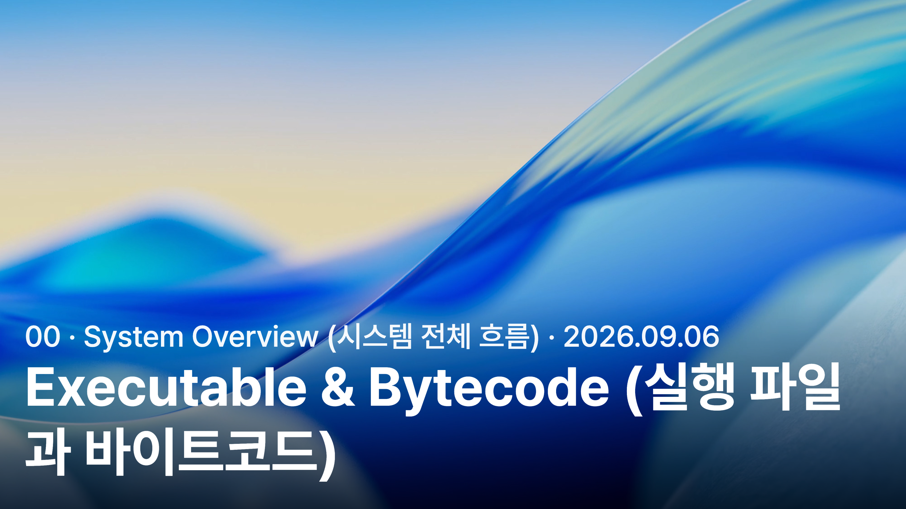
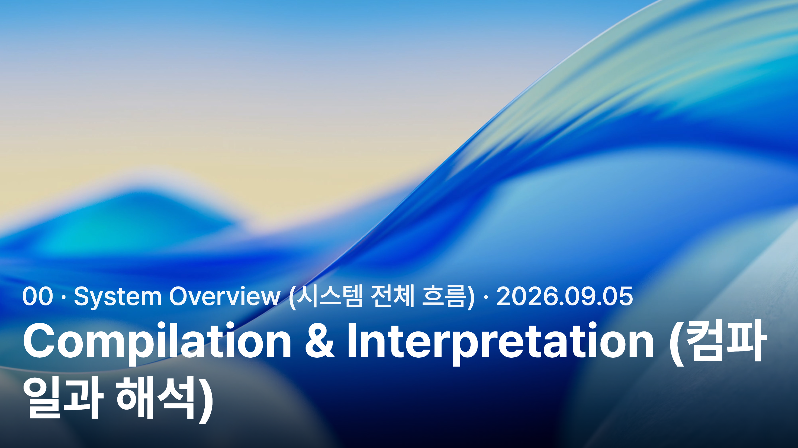

<a href="../../">MyPage_</a> / <a href="../">00 . System Overview (시스템 전체 흐름)</a> / Program Execution Flow (프로그램 실행 전체 흐름)

# Program Execution Flow (프로그램 실행 전체 흐름)

SUBCATEGORY (하위 카테고리) 02 · 2 ARTICLES (글)

## Articles (글)

<table>
  <tr>
    <td rowspan="2" width="40%" valign="top">
      
    </td>
    <td width="60%" valign="top">
      PROGRAM EXECUTION FLOW (프로그램 실행 전체 흐름) · 2026.09.06 
      <strong>Executable &amp; Bytecode (실행 파일과 바이트코드)</strong> 
      바이트코드와 JVM의 실행 구조부터 실행 파일 생성, 인메모리 실행, 운영체제가 프로그램을 시작하는 과정까지 정리했다.
    </td>
  </tr>
  <tr height="1">
    <td width="60%" height="1" valign="bottom">
      <strong><a href="./executable-bytecode/">Read Article (글 읽기) →</a></strong>
    </td>
  </tr>
</table>

<table>
  <tr>
    <td rowspan="2" width="40%" valign="top">
      
    </td>
    <td width="60%" valign="top">
      PROGRAM EXECUTION FLOW (프로그램 실행 전체 흐름) · 2026.09.05 
      <strong>Compilation &amp; Interpretation (컴파일과 해석)</strong> 
      컴파일과 인터프리테이션의 차이부터 AOT, JIT, 현대 언어 실행 방식까지 정리했다.
    </td>
  </tr>
  <tr height="1">
    <td width="60%" height="1" valign="bottom">
      <strong><a href="./compilation-interpretation/">Read Article (글 읽기) →</a></strong>
    </td>
  </tr>
</table>

---

[← Back to System Overview (시스템 전체 흐름으로 돌아가기)](../) · [MyPage_](../../)
