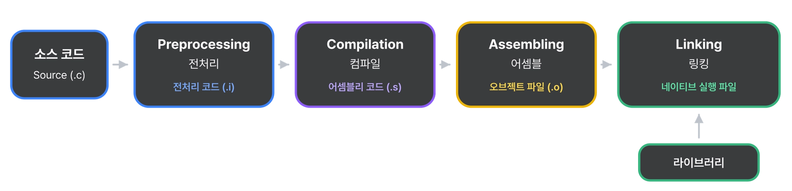

<sub><a href="../../../">MyPage_</a> / <a href="../../">00 . System Overview (시스템 전체 흐름)</a> / <a href="../">Program Execution Flow (프로그램 실행 전체 흐름)</a></sub>

# Source Code (소스 코드)

<sub>PROGRAM EXECUTION FLOW (프로그램 실행 전체 흐름) · 2026.09.21</sub>


## 왜 알아야 하는가?

컴퓨터의 작동 원리와 명령어의 구조를 이해하면,
내가 작성한 소스코드가 내부에서 어떻게 **해석**되고 **실행**되는지 명확히 예측할 수 있어 불필요한 연산을 줄이고 압도적으로 효율적인 고성능 코드를 설계할 수 있다.

우리는 고성능 코드를 설계하고 구현하기 위해, 내부적인 지식도 알 필요가 있다.

---

## Source Code와 High Level Language

Source Code(소스코드)와 High Level Language(고급 언어)에 대한 관계에 대해서 한번 알아보자.

### Source Code 소스코드

#### Source Code 소스 코드란?

소스 코드는 컴퓨터 소프트웨어(프로그램)의 제작에 사용되는 설계도라고 보면된다.

우리가 생각하는 추상적인 설계도가 아닌,
컴퓨터가 읽을 수 있고 명령을 수행할 수 있을 만큼 메우 세밀하고 구체적으로 짜인 설계도다.

> Source Code의 “Source = **근원**” 이란 뜻으로, 프로그램의 “**근원**”이라는 뜻이다.

#### Source Code와 프로그래밍 언어

건축물의 설계도나 전자 기계의 회로도가 주로 기호나 그림으로 이루어져 있는걸 본적이 있을것이다.

컴퓨터 프로그램의 설계도는 프로그래밍 언어로 작성되어 있다.
따라서 프로그래밍 언어에 대한 문법만 이해한다면 소스 코드의 뜻을 이해하고, 그 문법을 사용하여 소스 코드를 작성할 수 있을 것이다.

프로그래밍 언어의 문법을 사용하여 단어와 기호, 숫자를 정해진 규칙에 따라 조합하면 컴퓨터에게 특정한 작업을 시킬 수 있는 명령어가 만들어진다.

프로그램은 특정 명령어들의 집합이다.
그 명령어들은 소스 코드 즉 설계도이며, 설계도는 프로그래밍 언어로 작성되어 있다.
프로그래밍 언어의 문법을 따라서 명령을 만들수 있다.

그러면 이런 생각을 할 수 있다. “우리가 사용하는 프로그램은 그러면 프로그래밍 언어로 작성된 명령어들의 집합인가?”

맞다. 윈도우 11은 약 5천만줄, GTA 5 약 1억 줄의 코드로 구성되어 있다.

#### Source Code와 주석

소스 코드에는 컴퓨터에게 내리는 명령 외에도 프로그래머 등의 인간이 읽고 참조할 수 있는 안내문도 포함되어 있다.

이런 것은 대개 코드의 기능을 설명하는 주석이며, 개발 중인 프로그램에서 만약 협업을 하고있는 경우 다른 작업자들에게 추가/삭제/변경된 코드의 변경 의도에 대해 설명하는 메모가 포함되어있다.

팀 프로젝트 또는 대규모 프로젝트에선 코드도 굉장히 많을 뿐더러 기능이 굉장히 복잡한 경우가 많다.
다른 사람이 이 코드를 좀더 직관적으로 이해하고 작업할수 있도록, 주석을 잘 달아주는 것이 협업에서는 필수적인 요소 중 하나이다.

### High Level Language 고급 언어

#### High Level Language 고급 언어

소스 코드는 대부분 사람이 이해하기 쉬운 언어로 작성한다.
이런 언어를 High Level Language라고 한다.

여기서 "High = 고급"은 성능이 높다는 뜻이 아니며,
기계가 아닌 **사람의 사고방식에 가깝다**는 뜻이다.

C, C++, Java, Python, JavaScript, C#, Rust, Go가 대표적인 고급 언어에 속한다.

아래 한 줄은 "b와 c를 더해서 a에 저장한다"로 바로 읽힌다.

**고급언어로 작성한 a = b + c;**

```c
int a = b + c;
```

**저급언어로 작성한 a = b + c;**

```
mov eax, [b]
add eax, [c]
mov [a], eax
```

같은 동작을 Low Level Language로 쓰면 세 줄이 되는걸 볼 수 있다.

고급 언어는 이렇게 **여러 개의 저급 명령을 한 줄로 표현**한다.

High Level Language의 특징

- 사람이 읽고 쓰기 쉬운 문법을 사용한다.
- 변수, 조건문, 반복문, 함수 같은 **추상화된 개념**을 제공한다.
- CPU 종류(x86, ARM 등)와 관계없이 작성할 수 있다.
- 코드가 짧아서 개발 속도가 빠르고 유지보수가 쉽다.
- CPU의 실제 동작이 보이지 않는다. 내부 동작을 모르면 비효율적인 코드를 작성하기 쉽다.

하지만 CPU는 고급 언어를 이해하지 못하기 때문에 저급언어로 변환하게 된다.
아래에서 CPU가 이해하는 코드를 알아보겠다.

---

## Object Code와 Low Level Language

이번엔 Object Code(목적코드)와 Low Level Language(저급 언어)에 대한 관계에 대해서 한번 알아보자.

### Object Code 오브젝트 코드

#### **Object Code 오브젝트 코드란?**

오브젝트 코드는 소스 코드를 컴파일러가 번역해서 만들어낸 **결과물**이다.

소스 코드가 사람이 읽고 쓰는 설계도라면, 오브젝트 코드는 컴퓨터가 읽고 실행할 수 있도록 번역된 설계도다.

컴퓨터(CPU)는 사람이 쓰는 프로그래밍 언어를 이해하지 못한다.

CPU가 이해할 수 있는 것은 **0과 1로 이루어진 기계어**뿐이다.

따라서 우리가 작성한 소스 코드는 반드시 기계어로 번역되어야 하고, 이렇게 번역된 결과물이 오브젝트 코드다.

> Source Code의 “Source = 근원”이 프로그램의 출발점이라면, Object Code의 “Object = 목적물, 결과물”은 번역을 거쳐 나온 도착점이라고 보면 된다.

#### **Object Code와 파일**

오브젝트 코드는 보통 파일로 저장된다.

Windows에서는 `.obj`, Linux / macOS에서는 `.o` 확장자를 가진 파일이 오브젝트 파일이다.

이 파일은 기계어로 되어 있어서 메모장으로 열어보면 알아볼 수 없는 글자들만 보인다.

그리고 아직 완성된 프로그램이 아니다. 여러 오브젝트 파일과 라이브러리를 하나로 합치는 **링킹(Linking)** 과정을 거쳐야 비로소 실행 가능한 프로그램(.exe 등)이 된다.

### Low Level Language 저급 언어

#### **Low Level Language란?**

Low Level Language는 **하드웨어(CPU)에 가까운 언어**를 말한다.

여기서 “Low = 저급”은 성능이 낮다는 뜻이 아니다. 사람이 아닌 **기계에 가깝다**는 뜻이다.

저급 언어에는 두 가지가 있다.

| 종류 | 설명 |
| --- | --- |
| 기계어 (Machine Language) | 0과 1로 이루어진, CPU가 직접 이해하는 언어 |
| 어셈블리어 (Assembly Language) | 기계어를 사람이 읽을 수 있도록 `mov`, `add` 같은 기호(니모닉)로 바꾼 언어 |

예를 들어 x86 CPU에서 `eax`와 `ebx`를 더하는 명령은 아래와 같다.

```
어셈블리어 : add eax, ebx
기계어     : 01 D8   (이진수로는 0000 0001 1101 1000)
```

어셈블리어와 기계어는 거의 **1:1로 대응**된다.

그래서 어셈블리어는 기계어를 사람이 읽기 쉽게 표기한 것이라고 보면 된다.

#### **Low Level Language의 특징**

- CPU가 수행하는 동작 하나하나를 직접 지시한다.
- CPU 종류(x86, ARM 등)마다 명령어 체계가 달라서 **다른 CPU에서는 그대로 실행되지 않는다.**
- 코드가 길고 복잡하며 읽고 쓰기가 어렵다.
- 대신 하드웨어를 세밀하게 제어할 수 있고 실행 속도가 빠르다.

> High Level Language는 “이 방을 청소해줘”라고 말하는 것이고,<br>
> Low Level Language는 “오른쪽 팔을 30cm 뻗고, 빗자루를 잡고, 앞으로 한 걸음 걷고…”처럼 하나하나 지시하는 것이다.

---

## High Level -> Low Level 변환

### **왜 변환해야 하는가?**

앞에서 본 것처럼 CPU는 기계어(Low Level)만 이해한다.

사실상 우리가 컴퓨터에게 명령할 때는
”빗자루 위치를 보고, 거리를 재고, 어떻게 움직일지 생각하고 ….” 이렇게 명령을 내려야 한다

하지만 고급언어는 이것을 “이 위치에 있는 빗자루 잡아.” 로 명령하면 저급언어에 비해 추상적으로 명령해도 동작하게 만들어져있다.

간단하게 보면 고급언어는 저급언어에서 해야하는 세부적인 명령들을 추상화하여 인간이 사용하기 편하게 간단화 시킨것과 같다.

그런데 사람이 기계어로 프로그램을 짜는 것은 사실상 불가능에 가깝다. Windows 11의 5천만 줄, GTA 5의 1억 줄을 0과 1로 작성한다고 생각해보자.

그래서 사람은 읽고 쓰기 쉬운 High Level Language로 작성하고, 이를 **Low Level Language로 번역**하는 방식을 사용한다.

이 번역을 해주는 프로그램이 바로 **컴파일러(Compiler)**다.
[Compilation & Interpretation (컴파일과 해석)](../compilation-interpretation/)

---

### **변환 과정 (C/C++ 기준)**

소스 코드가 실행 파일이 되기까지는 여러 단계를 거친다.



---

### **그래서 왜 중요한가?**

같은 결과를 내는 코드라도 컴파일러가 만들어내는 기계어는 코드를 어떻게 작성했느냐에 따라 달라진다.

어떤 코드는 명령 몇 개로 끝나고, 어떤 코드는 불필요한 연산과 메모리 접근이 수십 배로 늘어난다.

결국 고급 언어가 저급 언어로 어떻게 변환되는지 알아야 **내가 짠 코드가 CPU에서 얼마나 많은 일을 하게 되는지 예측**할 수 있고, 이것이 고성능 코드를 설계하는 출발점이 된다.

---

[← Back to Program Execution Flow (프로그램 실행 전체 흐름으로 돌아가기)](../) · [System Overview (시스템 전체 흐름)](../../) · [MyPage_](../../../)
