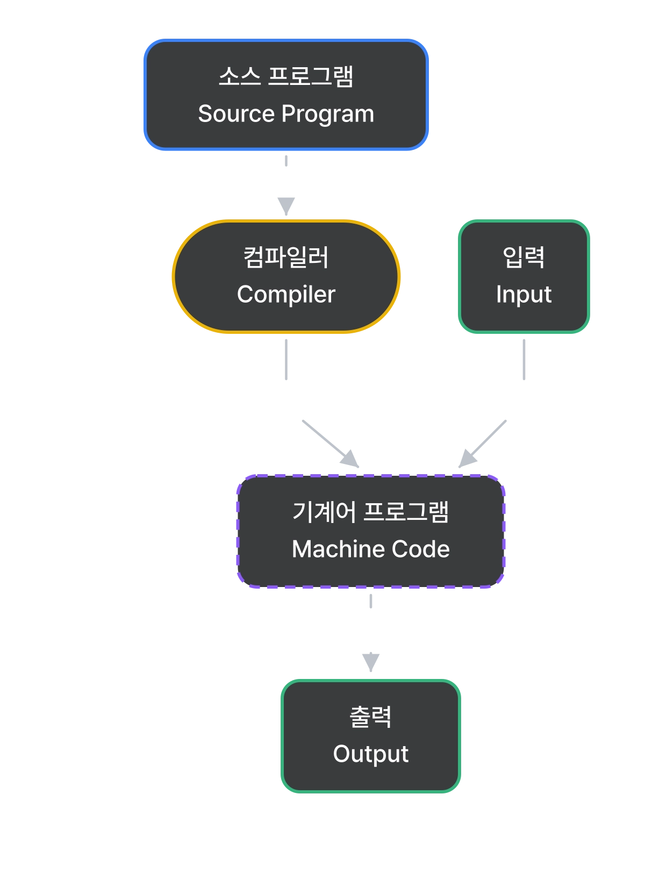
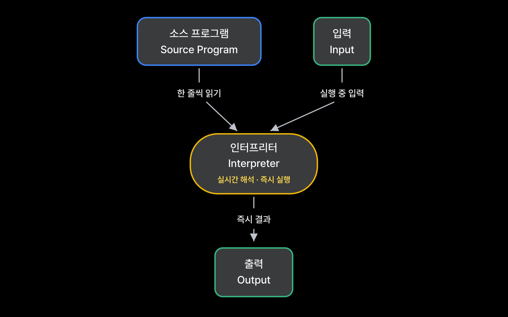
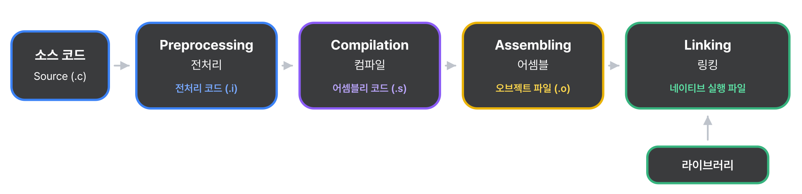
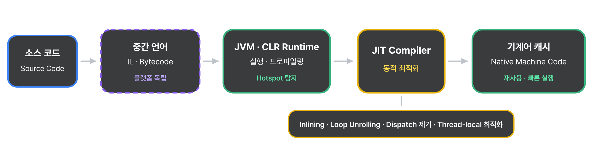
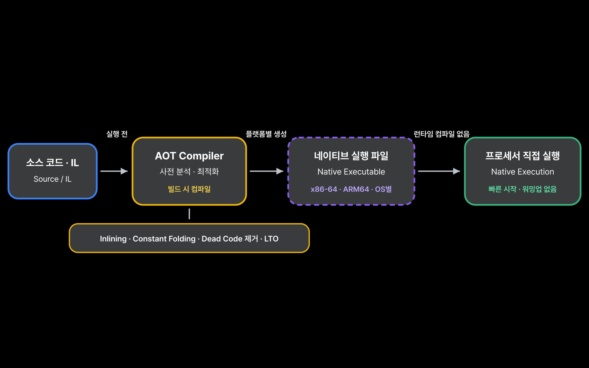

# Compilation & Interpretation (컴파일과 해석)

SYSTEM OVERVIEW · PROGRAM EXECUTION FLOW · 2026.09.05

## Compilation 컴파일

컴파일은 소스 프로그램을 기계어·어셈블리어·바이트코드 등의 목표 프로그램(Target Program)으로 번역하는 과정이며, 이를 수행하는 프로그램을 Compiler(컴파일러)라고 합니다.

### Pure Compilation

1. 컴파일러는 고수준 언어로 작성된 소스 코드를 기계어·어셈블리어·바이트코드 등의 목표 프로그램으로 번역합니다.
2. 목표 프로그램이 네이티브 기계어인 경우, 운영체제가 있는 환경에서는 실행 파일이 메모리에 적재되어 CPU에서 실행됩니다.
3. 컴파일러는 문법뿐 아니라 타입, 변수 선언, 유효 범위 등 언어 규칙에 따른 의미도 검사합니다.
4. 컴파일러는 컴파일 중에만 동작하며, 번역된 목표 프로그램이 실행될 때는 관여하지 않습니다.

### Compilation의 특징

목표 코드가 미리 생성되어 실행 중 번역 비용이 적기 때문에 일반적으로 실행 속도가 빠릅니다. 다만 실제 성능은 언어 구현, 최적화 방식과 실행 환경에 따라 달라집니다.

---

## Interpretation 인터프리테이션

인터프리테이션은 소스 코드나 중간 코드를 실행 중에 해석하여 수행하는 방식이며, 이를 담당하는 프로그램을 Interpreter(인터프리터)라고 합니다.

### Pure Interpretation

1. Interpreter는 프로그램이 실행되는 동안 소스 코드나 중간 코드를 해석하고 실행합니다.
2. 인터프리터가 프로그램의 실행을 처음부터 끝까지 관리합니다.
3. 소스 코드나 중간 코드의 명령을 차례로 해석하여 실행하며, 다음에 실행할 명령도 결정합니다.

### Interpretation의 특징

- 실행 중 변수와 프로그램 상태를 확인하기 쉬워 일반적으로 디버깅에 유리합니다.
- 별도의 네이티브 실행 파일을 미리 만들지 않고 코드를 실행할 수 있습니다.
- 실행하면서 해석하는 비용이 발생하므로 일반적으로 컴파일된 기계어보다 느립니다.
- 일부 실행 오류는 해당 코드가 실제로 실행될 때 발견됩니다.

---

## Compilation Process 컴파일 과정

> Preprocessing 전처리 → Compilation 컴파일 → Assembling 어셈블 → Linking 링킹

네이티브 실행 파일을 만드는 대표적인 Compile Process의 4단계 구조입니다.

그림의 `.c`, `.i`, `.s`, `.o` 확장자는 C/GCC 계열의 예시입니다.

### 1. Preprocessing 전처리

본격적인 분석 전에 소스 코드를 미리 가공합니다. 매크로 확장, 조건에 따른 코드 선택, 파일 포함 등을 처리하며 언어에 따라 생략될 수 있습니다.

### 2. Compilation 컴파일

소스 코드의 어휘, 구문, 의미를 분석하고 오류를 검사합니다. 분석한 코드를 최적화한 뒤 어셈블리어나 목적 코드로 변환합니다.

### 3. Assembling 어셈블

어셈블리어를 CPU가 이해할 수 있는 기계어로 변환하여 오브젝트 파일을 만듭니다. 오브젝트 파일에는 아직 연결되지 않은 함수나 주소 정보가 남아 있을 수 있습니다.

### 4. Linking 링킹

여러 오브젝트 파일과 필요한 라이브러리를 연결합니다. 외부 함수와 주소를 확정하여 최종 실행 파일을 만듭니다.

> 모든 언어와 컴파일러가 정확히 이 과정을 따르는 것은 아닙니다. 일부 단계는 합쳐지거나 생략될 수 있으며, 바이트코드를 만드는 컴파일러는 어셈블과 링킹을 거치지 않을 수도 있습니다.

---

## JIT

### JIT란?

JIT는 프로그램 실행 중 필요한 코드를 기계어로 컴파일하여 바로 실행하는 방식입니다.

일반적으로 중간 언어(Intermediate Language 또는 IL)나 바이트코드를 사용하며, 실행 중 수집한 정보를 바탕으로 코드를 최적화하기도 합니다. 대표적으로 Java의 HotSpot JVM과 C#의 .NET 런타임이 JIT 컴파일을 사용합니다.

### JIT 장단점

#### 장점

- **실행 성능 향상**: 자주 실행되는 코드(hot spot)를 기계어로 변환하여 반복적인 해석 비용을 줄입니다.
- **런타임 최적화**: 실행 중 수집한 타입과 호출 정보를 바탕으로 현재 실행 환경에 맞게 코드를 최적화합니다.
- **중간 코드의 이식성**: 같은 바이트코드나 중간 언어를 호환 런타임에서 실행하고, 각 플랫폼의 기계어로 변환할 수 있습니다.

#### 단점

- **초기 실행 지연**: 실행 중 컴파일과 최적화를 수행하므로 시작 단계나 워밍업 구간이 느릴 수 있습니다.
- **메모리 사용 증가**: 기계어로 변환된 코드를 캐싱하므로 메모리를 추가로 사용합니다.
- **복잡성 증가**: JIT 컴파일러는 복잡한 최적화 작업을 수행하므로 구현 및 디버깅이 더 어렵습니다.

### JIT 최적화 기법

1. **인라이닝(Inlining)**: 작은 메서드의 내용을 호출 위치에 삽입하여 함수 호출 비용을 줄입니다.
2. **루프 언롤링(Loop Unrolling)**: 반복문 본문을 여러 번 펼쳐 반복 횟수와 분기 비용을 줄입니다.
3. **동적 디스패치 제거(Devirtualization)**: 실행 중 수집한 타입 정보를 이용해 가상 메서드 호출을 직접 호출로 바꿉니다. 가정이 깨지면 최적화를 되돌릴 수 있습니다.
4. **탈출 분석과 잠금 제거(Escape Analysis & Lock Elision)**: 객체가 메서드나 스레드 밖으로 나가는지 분석하여 불필요한 객체 할당이나 동기화를 제거합니다.

---

## AOT

### AOT란?

AOT는 프로그램을 실행하기 전에 소스 코드나 중간 언어를 특정 플랫폼의 기계어로 미리 컴파일하는 방식입니다. 실행 시점에는 JIT 컴파일 없이 생성된 네이티브 코드를 실행합니다.

C, C++, Rust, Go 등의 일반적인 구현이 대표적인 AOT 컴파일 사례입니다.

### AOT 장단점

#### 장점

- **빠른 시작 속도**: 실행 중 별도의 컴파일 과정이 없어 프로그램을 빠르게 시작할 수 있습니다.
- **일관된 실행 성능**: JIT의 준비 과정인 워밍업이 없어 처음부터 비교적 안정적인 성능을 제공합니다.
- **낮은 런타임 부담**: JIT 컴파일러와 코드 캐시가 필요하지 않아 실행 중 컴파일에 필요한 메모리와 작업 부담을 줄일 수 있습니다.

#### 단점

- **긴 빌드 시간**: 실행 전에 코드 분석과 최적화를 완료해야 하므로 빌드 시간이 길어질 수 있습니다.
- **런타임 정보 활용의 한계**: 실제 실행 중 수집되는 정보를 활용하기 어려워 JIT보다 상황에 맞는 최적화가 제한될 수 있습니다.
- **플랫폼 의존성**: 기계어는 CPU와 운영체제에 따라 달라지므로 플랫폼별로 다시 컴파일해야 합니다.

### AOT에서 사용하는 대표적인 정적 최적화

1. **인라이닝(Inline Expansion)**: 함수 호출 위치에 함수의 내용을 삽입하여 호출 비용을 줄입니다.
2. **상수 폴딩(Constant Folding)**: 컴파일 시점에 계산할 수 있는 값을 미리 계산합니다.
3. **죽은 코드 제거(Dead Code Elimination)**: 실행 결과에 영향을 주지 않는 불필요한 코드를 제거합니다.
4. **링크 타임 최적화(Link Time Optimization)**: 여러 파일의 코드를 함께 분석하여 프로그램 전체를 최적화합니다.

---

## AOT와 JIT 비교

| 구분 | AOT (Ahead-of-Time) | JIT (Just-in-Time) |
|---|---|---|
| **컴파일 시점** | 실행 전 | 실행 중 |
| **초기 실행 속도** | 빠름 | 상대적으로 느림 |
| **최적화 방식** | 정적 분석·LTO·사전 프로파일 활용 | 런타임 정보를 이용한 동적 최적화 |
| **실행 중 컴파일 부담** | 적음 | 추가 자원 사용 |

---

## 현대 프로그래밍 언어의 실행 방식

현대 프로그래밍 언어의 구현은 컴파일과 인터프리테이션을 함께 사용하는 경우가 많습니다. 핵심은 언어 이름보다 구현이 코드를 언제 변환하고, 실행 중 누가 제어권을 가지는지입니다.

1. **코드 처리 방식**
   - **Compilation**: 소스 코드나 중간 코드를 목표 코드로 변환합니다. 실행 전에는 AOT로, 실행 중에는 JIT로 수행될 수 있습니다.
   - **Interpretation**: 실행 중에 인터프리터가 소스 코드나 중간 코드의 명령을 수행합니다.
2. **실행 중 제어권**
   - **Pure Compilation**: 변환된 목표 프로그램이 실행되며 컴파일러는 관여하지 않습니다.
   - **Pure Interpretation**: 인터프리터가 계속 존재하며 프로그램의 실행을 관리합니다.
3. **컴파일 시점**
   - **AOT**: 프로그램 실행 전에 코드를 미리 컴파일합니다.
   - **JIT**: 프로그램 실행 중 필요한 코드를 기계어로 컴파일합니다.

AOT와 JIT는 모두 컴파일 방식이며, 코드를 컴파일하는 시점에 차이가 있습니다.

Java는 소스 코드를 바이트코드로 미리 컴파일한 뒤 JVM 구현에서 이를 해석하거나 JIT 컴파일할 수 있습니다. CPython은 소스 코드를 바이트코드로 변환한 뒤 가상 머신에서 실행하며, JavaScript 엔진은 일반적으로 인터프리터와 JIT 컴파일러를 함께 사용합니다.

따라서 언어 자체를 한 방식으로 단정하기보다, 해당 언어 구현이 코드를 어떻게 처리하고 실행하는지 살펴봐야 합니다.

---

[← Program Execution Flow로 돌아가기](../) · [System Overview](../../) · [MyPage_](../../../)
