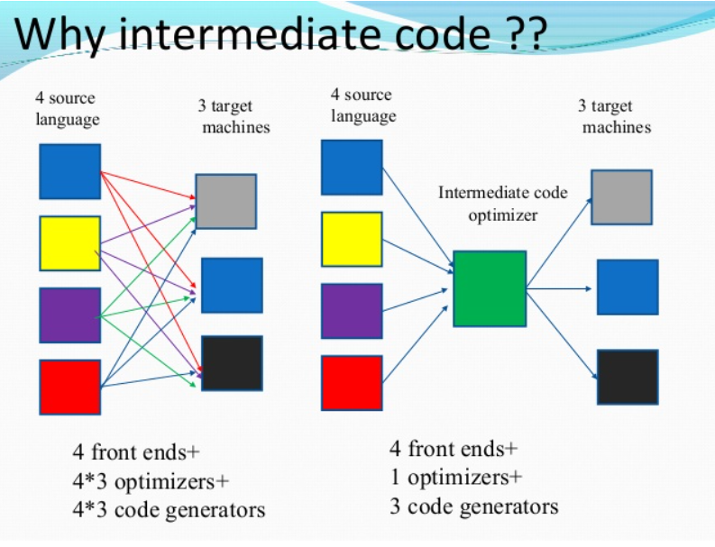
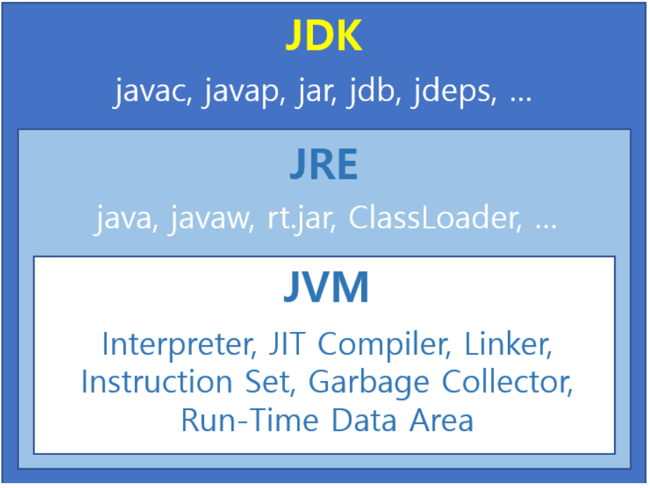
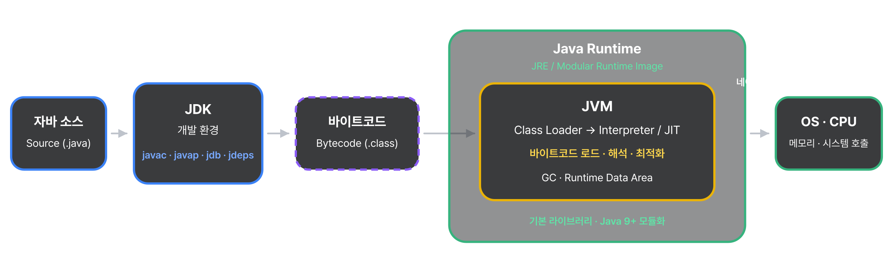

<a href="../../../">MyPage_</a> / <a href="../../">01 . Programming &amp; Execution (프로그래밍과 실행)</a> / <a href="../">Programs &amp; Executables (프로그램과 실행 파일)</a>

# Bytecode (바이트코드)

PROGRAMS &amp; EXECUTABLES (프로그램과 실행 파일) · 2026.09.11

바이트코드는 (Bytecode)는 고급 언어로 작성된 소스 코드를 가상머신이 이해할 수 있는 중간 코드로 컴파일한 것을 말한다.
쉽게 말하자면 JVM, PVM같은 VM(가상머신)이 이해할 수 있는 중간 코드로 컴파일한것이 바이트코드다.
위키피디아에선 “**특정 하드웨어가 아닌 가상 컴퓨터에서 돌아가는 실행 프로그램을 위한 이진 표현법”**이다 라고 나와있다.

이진 표현법이라고 해서 바이너리 코드와 혼동하면 안된다.
바이트코드는 어떤 플랫폼에서 종속되지 않고. 가상머신에서 이해할수있는 이진코드를 의미한다.

---

## 왜 사용하는가?

원시 코드에서 바이트코드로는 컴파일로 진행이 되고, 가상머신은 이 바이트코드를 실제 머신에 맞게 구현된 인터프리터로 해석하여 실제 머신 기계어 코드를 실행한다.

바이트코드를 생성하는것까지는 컴파일이며, 바이트코드 자체는 인터프리터 언어라는 것입니다.
덕분에 (텍스트를 직접 읽어 실행하는) 인터프리터 언어의 단점인 느린 실행속도를 극복하면서도 동시에 (가상머신이라는 단일 종류의 구현을 통해) 호환성이 보장된다.

---

## JVM이란?

Bytecode를 인터프리터 방식으로 실행시키는것이 VM이며,
대표적으로 JVM이 있기에 한번 짚고 넘어가보자.

바이트코드(.class파일)를 OS에 맞는 기계어로 변환하고,
이를 클래스 로더에서 읽어와 메모리 영역에 저장/관리하고,
이를 실행엔징에서 바이트코드 명령어 단위로 읽어들여 실행하며
가비지 컬렉터(GC)로 메모리 관리를 하는 가상 머신을 말한다.

자바 프로그램은 설치된 컴퓨터 운영체제에 대해서 독립적이라 말할 수 있다.
컴퓨터에서 프로그램을 직접 실행하는 게 아니라 인터페이스 역할을 하는
자바 가상머신 (JAVA virtral machine)에 의해 실행되기 떄문이다.
이것은 자바의 탄생 이유이자 목적이기도 하다.

---

## Bytecode를 사용하는 이유가 뭘까?

해당 이미지를 한번 살펴보자.

한마디로 Intermediate code optimizer(코드 최적화 장치)라는 중간 단계를 하나 둬서 간접화를 통해 경우의 수를 낮추고 효율을 높이기 위해 중간 코드를 생성한다.

---

## Bytecode의 생성과정

이렇게 경우의 수를 낮추고 효율을 높이기 위해 만들어진 바이트코드 또한, 결국의 기계가 이해하기 위해 기계어로 번역이 돼야한다.
이때 인터프리터를 사용하여 프로그램이 실행 중인 런타임 시 한 줄씩 읽기 때문에 런타임 전 소스코드를 미리 읽어서 기계어로 변환하는 방식의 컴파일러보다는 느릴 수밖에 없다.

이런 문제를 개선해 주는 것이 JIT컴파일러이다.
JIT 컴파일러 [Compilation & Interpretation (컴파일과 해석)](../../../00-system-overview/02-program-execution-flow/compilation-interpretation/) 해당 문서에 설명되어있다.

---

## JVM은 바이트코드를 어떻게 실행할까?

### JDK 자바 개발 환경 (Java Development Kit)

컴파일러(javac), 역어셈블러(javap), 디버거(jdb), 의존관계 분석(jdeps) 등 개발에 필요한 도구 및 내장 함수를 제공한다.

### JRE 자바 실행 환경 (Java Runtime Enviorment)

자바 실행 명령, 프로그램 실행 실패 등이 발생할 경우 대화 상자를 표시하는 시작 프로그램 파일(javaw.exe)
클래드로더(.class)와 바이트코드의 실행(java.exe)에 필요한 기본 라이브러리(rt.jar)를 제공한다.

JAVA 9 이후부터 모놀리틱 구조를 통해 한 rt.jar에 핵심 클래스 또는 자바 API를 전부 넣지 않고,
각각 모듈화하여 작은 모듈들로 쪼개서 사용합니다. 성능과 불필요한 클래스를 최적화하여 전체적으로 성능이 개선되었습니다.

### JVM 자바 가상 머신 ( Java Virtual Machine )

바이트코드 인터프리터, JIT 컴파일러, 링커, 명령어 세트, 가비지 컬렉터(GC), 런타임 데이터 영역 등
OS에 독립적으로 실행될수 있는 추상층을 제공한다.

### Bytecode 실행과정

JVM에서 바이트코드를 실행하는 과정을 간단히 보자면
JDK를 사용해서 바이트코드(.class 파일)를 만들고
JRE를 사용해서 바이트코드를 실행하게 요청하면
JVM이 구동되면서 바이트코드의 실질적인 실행(실제 OS에 메모리 할당/회수, 시스템 명령 호출등 요청)을 하게 된다.

---

[← Back to Programs & Executables (프로그램과 실행 파일로 돌아가기)](../)
