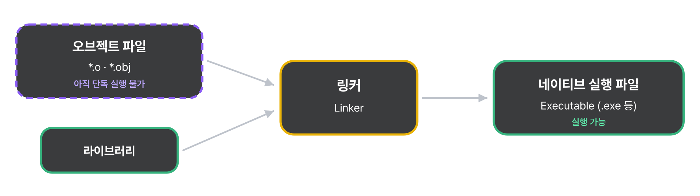
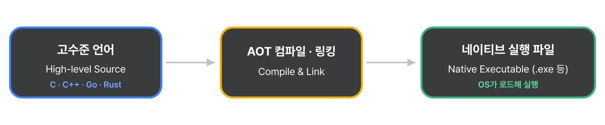
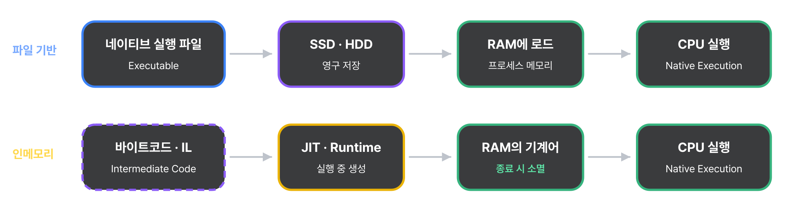
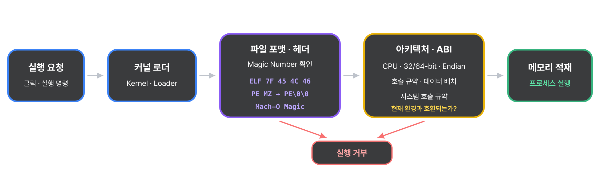
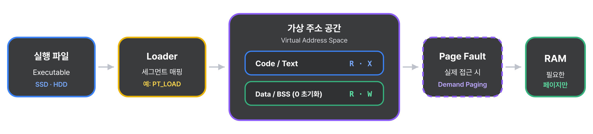
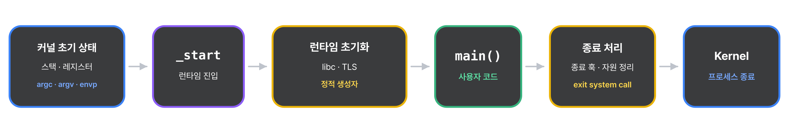

<a href="../../../">MyPage_</a> / <a href="../../">01 . Programming &amp; Execution (프로그래밍과 실행)</a> / <a href="../">Programs &amp; Executables (프로그램과 실행 파일)</a>

# Executable (실행 파일)

PROGRAMS &amp; EXECUTABLES (프로그램과 실행 파일) · 2026.09.11

## Executable이 무엇인가?

컴퓨터 공학에서 실행 파일(Executable)이란 무엇인가?
실행 파일은 단순히 데이터만 담고 있는 파일과 달리 코드화된 명령에 따라 지시된 작업을 수행하도록 하는 컴퓨터 파일을 말한다.

인터프리터나 CPU, 또는 가상 머신을 위한 명령을 포함하는 파일들을 실행 파일이라고 생각할수 있다.
하지만 좀더 구체적으로 보자면 이것은 스크립트나 바이트코드라고 생각해야한다.
실행 파일들은 **이진파일**(바이너리 코드, 바이트코드)로 불리며 이는 프로그램의 원시 코드와는 대비되는 용어다.

**실행 가능한 코드**(Executable code)는 실행 가능한 명령어들의 단락들로 표현된다.
예를 들자면 프로그램 내의 섹션들이 있다.

---

## 실행 파일 생성

실행 파일은 0과 1로 이루어진 기계어로 직접 코딩할수도 있다.
하지만 그것은 너무 어렵기(불가능에 가깝다)에 사람이 이해하기 쉬운 고수준 언어로 개발되는것이 보통이다.
(C, C++, JAVA와 같은 고수준 언어)

고수준 언어는 실행 가능한 기계 코드 파일 또는 실행할 수 없는 기계 코드 객체 파일 종류의 것으로 컴파일된다.
이해하기 힘들 수 있으니 나눠서 설명해보겠다.

### “실행 가능한 기계 코드 파일”이란?

- 한번에 최종 완성품을 만드는 경우이다.

- 고수준 언어를 컴퓨터가 기계어로 바꾸었더니, 그 자체로 즉시 더블클릭해서 켤 수 있는 완벽한 프로그램 파일(\*, exe 등)이 나오는 것을 말한다.

- 대표적으로 AOT 컴파일같은 경우가 이 내용에 해당한다.

- C, C++, Go, Rust가 AOT 컴파일 방식을 사용한다.

### “실행할 수 없는 기계 코드 객체 파일”이란?

- 레고 블록처럼 부품 파일만 먼저 만드는 경우이다.

- 고수준 언어를 기계어로 바꾸긴 했지만 아직 다른 부품(라이브러리나 다른 코드 조각)들과 합쳐지지 않아서 당장은 실행할 수 없는 ‘미완성 조각 파일’(\*, obj 또는 \*.0 등)이 나오는 것을 뜻한다.

- 이렇게 컴파일된 미완성 조각들을 하나로 묶어 완벽한 실행 파일로 만들어야 하기에 그것을 하나로 만드는 과정을 ‘링크(link)’라고 부른다. 이것들은 보통 ELF(Executable and Linkable Format)라는 표준 컨테이너 포맷에 담겨 관리된다. ( ELF에 대해서는 다른 글에서 설명해보겠다. )

- 대표적으로 JVM + JIT 컴파일이 이 내용에 해당한다.

- Java, Kotlin이 VM + JIT 컴파일 방식을 사용한다.

AOT, JIT에 대한 내용은 [Compilation & Interpretation (컴파일과 해석)](../../../00-system-overview/02-program-execution-flow/compilation-interpretation/)  해당 내용을 참고하자.

이런식으로 컴파일 되어 완성된 실행 파일은 보통 보조 기억장치인 SSD나 하드디스크에 파일 형태로 영구저장된다.
하지만 그것중에도 예외가 있으며 보안이나 속도를 위해 하드디스크를 거치지 않고 오직 메모리(RAM)안에서만 즉성으로 실행 코드를 만들어 낸 뒤 종료 시 증발시키는 ‘**인메모리(In-Memory)**’방식의 실행 형태도 존재한다.

---

### In-Mermory 인메모리

영구저장 가능한 SSD나 하드디스크를 사용하지 않고, 굳이 휘발성 메모리인 (RAM)을 쓰는 이유가 분명 있을것이다.
뭐든 생각할때 어떤 방식을 사용하거나 기술을 접목하여 사용할때, 그것을 왜 사용하는지에 대한 궁금증을 가져야한다.
잠시 인메모리(In-Memory)방식을 사용하는 이유에 대해서 한번 알아보자.
인메모리 방식을 사용하는 이유는 크게 3가지가 존재한다.

- 압도적인 속도
    - 기술이 발전하면서 SSD도 빨라졌지만, RAM은 SSD보다 수십 배에서 수백 배 이상 더 빠르다. 0.001초가 중요한 실시간 연산이나 웹 브라우징에서는 RAM에서 즉석으로 코드를 만들고 실행하는 게 훨씬 유리하다.

- 흔적 없는 보안
    - 하드디스크는 데이터를 단순 삭제해도 물리적 흔적을 남긴다. 운영체제(OS)에서 파일을 지우는 것은 실제 데이터를 없애는 것이 아니라, 데이터가 있던 위치의 ‘주소(index)’만 지워 빈공간으로 표시하는것이다. 그렇기에 새로운 데이터가 그 자리에 완전히 덮어씌워지기 전까지는 기존 파일의 자성 기록이 디스크에 그대로 남는다. 그렇기에 메모리에서만 잠깐 실행하고 휘발시키게 되면 흔적이 완전히 증발한다. 그렇기에 보안이 극대화된다.

- 환경에 맞춘 유연성
    - 사용자가 실행파일을 실행시킬때 플랫폼이 제각각이다. 그렇기에 미리 디스크에 고정된 파일을 만들어두는 것보다 실행하는 순간 사용자의 플랫폼 환경에 맞춰진 최적의 기계어 조각을 메모리에 짜는 것이 좀 더 효율적이다.

대표적인 예시를 몇개 들어보겠다.

- 웹 브라우저의 실시간 코드 변환 (JIT컴파일) \[속도와 유연성\]
    - 웹사이트를 접속할때 받는 JS 코드는 디스크에 실행파일로 저장되지 않는다. 브라우저 엔진이 사용자의 RAM위에서 실시간으로 JIT컴파일 방식으로 컴파일하여 화면을 띄우고 프로그램을 실행한다. 브라우저 탭을 닫으면 해당 JS는 필요없기에 메모리에서 흔적도 없이 사라지게 된다.

- 리눅스/유닉스의 쉘 내장 명령어(cd, exit 등) \[속도\]
    - 터미널에서 사용하는 명령어들은 하드디스크 내에 저장하지 않습니다. 쉘 프로그램(Bash, Zsh 등)이 실행될 때 아예 프로세스 자체의 사용자 메모리 공간에 함께 포함되어 띄워지기 때문이다. 터미널 명령을 실행할때마다 하드디스크를 읽어서 명령어 실행파일을 가져오게되면 비효율적이기에 쉘 명령어같은 경우엔 RAM 안에서 즉시 처리하여 반응 속도를 극대화한다.

- 보안 프로그램 및 파일리스(Fileless) 코드 \[보안\]
    - 백신 프로그램의 실시간 감시 기능, 금융권의 보안 모듈과 같은 보안이 중요한 **실행 코드는 디스크에** .exe 같은 파일을 생성하지 않는 경우가 있다. 네트워크를 통해 실행 파일을 받아온 뒤, RAM의 빈 주소 공간으로 바로 주입(injection)하여 실행한다. 하드디스크에 파일이 저장되는 순간 역분석(decompile)을 당하기 쉽기에 흔적을 남기지 않는 인메모리(In-Memory)방식을 사용한다.

---

## 파일은 어떤 방식으로 실행되는가?

이렇게 완성되어 저장된 실행 파일을 실행시킬때의 과정을 한번 살펴보자.

### OS의 규칙확인 (ABI와 파일 포맷 검증)

사용자가 파일을 실행하거나 터미널에서 실행 명령을 내리면, 운영체제의 커널(Kernel)이 가장 먼저 개입하여 이 파일이 실행 가능한지 검증한다.

- 매직 넘버 (Magic Number) 확인
    - 운영체제(OS)는 파일의 가장 첫 부분(헤더)에 적힌 몇 바이트의 고유 식별코드를 읽는다. Linux는 `Ox7E ‘E’ ‘L’ ‘F’` 윈도우는 `‘M’ ‘Z’` 포맷을 확인 하여 현재 OS가 실행할 수 있는 형식인지 검증한다.

- ABI (Application Binary Interface) 매칭
    - ABI (Application Binary Interface)란?
        - ABI는 컴파일된 기계어 수준에서 운영체제(OS) 및 하드웨어와 소통하는 규격이다.
        - 함수 호출 규약 (Calling Convention) / 데이터의 크기와 정렬 (Alignment) / 시스템 호출 (System Call) 과 같은 규칙을 정의한다.
        - 여기에서 간단하게 비유하자면 OS가 프로그램에게 주는 인터페이스(규칙)에 가깝다. 하드웨어를 사용하는 부분에 대해서 규칙이 정의되어있다. OS에서 제공하는 라이브러리라고 생각하면 편하다.
    - 윈도우 커널의 ABI를 따르는 실행 파일일 경우
        - 맥(Mach-O)이나 리눅스 커널은 이를 이해하지 못하고 실행을 거부하게된다.
        - 한마디로 해당 운영체제(OS)에서 실행 파일을 실행시킬수있게 만드는 규격인 셈이다.
    - 왜 ABI 안정성이 중요한가?
        - [위키피디아(wikipedia)](https://ko.wikipedia.org/wiki/%EC%9D%91%EC%9A%A9_%ED%94%84%EB%A1%9C%EA%B7%B8%EB%9E%A8_%EC%9D%B4%EC%A7%84_%EC%9D%B8%ED%84%B0%ED%8E%98%EC%9D%B4%EC%8A%A4#cite_note-1)에 있는 ABI 설명을 보면 **“ISV (Independent Software Vendor)에게 중요하다”**라는 말이 있다.
        - 만약 리눅스나 윈도우 같은 OS가 업데이트되면서 ABI가 바뀐다면, 기존에 잘 돌아가던 게임이나 오피스 프로그램 가은 이진 파일들이 소스 코드를 다시 수정해서 컴파일 하지 않는 한 모두 먹통이 되어버리기 때문이다.
        - 따라서 OS와 라이브러리 개발자들은 하위 호환성을 유지하기 위해 이 ABI를 최대한 바꾸지 않고 유지하려고 노력한다.

---

### 메모리 로딩 (Loader와 가상 메모리 매핑)

ABI과 파일 포맷 검증이 끝나면 운영체제(OS)의 로더(Loader)가 실행 파일을 메모리로 올리는 작업을 시작한다.
단순히 파일을 통째로 복사하는 것이 아니라, 현재 OS는 매우 영리하게 가상 메모리를 활용한다.

- 가상 주소 공간 할당
    - OS는 이 프로그램만을 위한 독리보딘 공간인 가상 주소 공간(Virtural Address Space)을 생성한다.

- 섹션별 메모리 매핑 (Mapping)
    - 로더는 실행 파일 내부에 나뉘어있는 섹션들을 가상 메모리에 매핑하고 권한을 부여한다.
    - Code(Text) 섹션
        - 실제 기계어 명령어가 있는 곳이며, 덮어쓰기를 방지하기 위해 읽기/실행(Read/Execute) 권한만 준다.
    - Data / bss 섹션
        - 전역 변수나 정적 변수가 저장되는 곳이며, 값을 변경해야 하므로 읽기/쓰기(Read/Write) 권한을 준다.

- 지연 로딩 (Demand Paging)
    - 메모리 낭비를 막기 위해 처음부터 파일 전체를 RAM에 올리지 않는다.
    - 일단 가상 메모리 주소만 연결해 두고, CPU가 실제로 해당 코드를 실행하려고 할 때(PageFault 발생) 비로소 SSD/HDD에서 필요한 부분만 RAM으로 가져온다.

---

### 시작점으로 점프 (Entry Point와 CPU 레지스터 설정)

메모리 세팅이 완료되면 제어권이 운영체제에서 CPU로 넘어간다.

- 시작점 (_start)
    - 많은 사람들이 프로그램의 시작점을 main() 함수로 알고 있지만, 사실 실행 파일 헤더에 적힌 실제 엔트리 포인트(Entry Point)주소는 `_Start`라는 시스템 함수다.

- 프로그램 카운터(PC) 설정
    - OS는 CPU 내부의 가장 중요한 레지스터인 PC(Program Counter, 또는 RIP) 레지스터에 이 엔트리 포인트 주소를 강제로 주입한다.

- 컨텍스트 스위칭 완료
    - PC(Program Counter) 레지스터 값이 바뀌는 순간, CPU는 다음 클럭부터 운영체제의 코드가 아닌, 방금 실행한 프로그램의 기계어 명령어를 읽기(Fetch) 시작합니다.

---

### Runtime System과 프로그램 초기화

CPU가 엔트리 포인트(`_Start`)로 점프한 직후, 우리가 짠 main()함수가 곧바로 실행되는것은 아니다.
그 전에 런타임 시스템(Runtime System)이 함수가 실행될수있는 환경을 세팅한다.

- C 런타임 (CRT) 초기화
    - `_Start` 가 실행되면, 컴파일러가 삽입한 런타임 코드(예: C의 CRT0)들이 먼저 작동한다.
        - 명령행 인자(argc, argv)와 환경변수(envp)를 정리하여 스택에 세팅한다.
        - 전역 변수 중 초기화되지 않은 변수 영역(BSS)을 0으로 초기화한다.
        - main() 함수가 실행되기 전에 먼저 실행되어야 하는 정적 생성자들을 호출한다. (정적 생성자: 클래스의 정적 데이터(static data)를 초기화하거나 단 한 번만 수행해야 하는 작업을 처리 할때 사용하는 특수 생성자)

- 환경 세팅 후 main() 호출
    - 이 모든 인프라 세팅이 끝나면 비로소 우리가 작성한 main() 함수를 호출(Call)하며 프로그램이 사용자에게 시각적으로 보이게된다.

- 프로그램 종료 처리
    - main() 함수가 return 0;을 하거나 끝이나면, 다시 런타임 코드로 제어권이 돌아온다.
    - 런타임 시스템(Runtime System)은 사용했던 자원을 정리하고, 최종 종료 상태 코드를 들고 운영체제(OS) 커널에게 “이 프로그램을 완전히 종료시켜주세요”라며 시스템 콜(System Call)을 보내고 프로세스를 소멸시키게된다.

---

이 과정속에서**가상 메모리 매핑**과 **프로세스 소멸 과정**, **ELF 상세**에 대해선 따로 글로 정리하겠다.
이러한 과정들을 통해서 우리가 생성한 실행 파일은 작동되게 되며, 종료된다.

---

[← Back to Programs & Executables (프로그램과 실행 파일로 돌아가기)](../)
