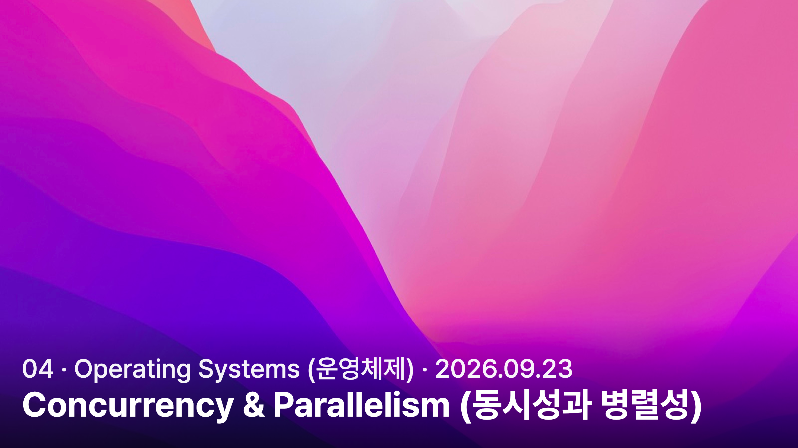

<a href="../../../">MyPage_</a> / <a href="../../">04 . Operating Systems (운영체제)</a> / <a href="../">Concurrency &amp; Synchronization (동시성·동기화)</a>

# Concurrency & Parallelism (동시성과 병렬성)

CONCURRENCY &amp; SYNCHRONIZATION (동시성·동기화) · 2026.09.23

## Concurrency (동시성)

동시성이란, 싱글 코어로 여러 작업을 번갈아 가면서 작업을 수행하는 것이다.
싱글 코어에서 작업을 아주 빠르게 전환하며 처리하여 사용자나 시스템이 동시 실행을 느끼게 만든다.

여기서는 이해하기 쉽게 싱글 코어를 기준으로 설명한 것이다.
정확히는 동시성이란 여러 작업이 끝나기 전까지 그 진행을 함께 다루는 개념이며, 멀티 코어에서도 적용된다. 반드시 같은 순간에 실행되어야 하는 것은 아니다.

### 왜 이런 개념이 탄생했는가?

사실 CPU를 100% 극한의 효율로 사용하려고 만든 개념이라고 생각하면된다.
한 작업을 하는동안엔 다른작업을 못했기에 싱글코어로 작업을 정말 빠르게 왔다갔다 하게되면 동시적으로 처리되는것 처럼 보일것이다. 라는 생각에서 만들어졌다.

#### CPU의 유휴 시간(Idle Time) 최소화

CPU는 엄청나게 빠르지만, I/O 작업은 수백만 배 이상 느리다.
그렇기 때문에 파일을 읽거나 네트워크를 읽고 쓰는 I/O 작업을 하는 동안엔 CPU는 계속 멈춰있는 상태로 있어야했다.

그렇기에 CPU의 유휴 시간(Idle Time)을 최소화 하여 CPU가 최대한 효율적으로 일을 할 수 있도록 나온 개념이 동시성이다.

동시성 덕분에 어떤 프로그램이 I/O 작업을 기다리는 동안 CPU는 즉시 다른 프로그램으로 전환하여 일을 처리하게되었으며, CPU를 거의 100% 낭비없이 사용할 수 있게 되었다.

#### 멀티태스킹과 사용자 경험(UX) 향상

과거엔 노래를 들으며 다른 작업을 하거나, 파일 다운로드와 웹서핑을 동시에 할 수 없었다.
왜냐? CPU는 한 작업을 하는동안 먹통이 되기 때문이다.

그래서 적용된 동시성은 CPU가 여러 프로그램을 아주 빠르게 번갈아 실행함으로써,
사용자가 여러 앱을 동시에 부드럽게 사용하고 있다는 느낌(멀티태스킹)을 줄 수 있게 되었다.

### 무슨 원리로 작동하는가?

요리사 한 명이 라면과 김밥을 만드는 상황을 생각하면 된다.
라면 물을 올려놓고, 물이 끓는 동안 김밥을 만든다. 손으로 하는 일은 한 번에 하나지만 두 요리는 함께 진행되고 있다.

CPU도 한 작업이 기다리는 동안 다른 작업을 처리할 수 있다. 기다리는 일이 없어도 실행 시간을 나눠 여러 작업에 차례를 준다.

#### CPU 스케줄링(CPU Scheduling)

운영체제는 실행할 준비가 된 작업 중에서 다음에 CPU를 사용할 작업을 고른다. 이 선택을 담당하는 것이 스케줄러이다.

여기서 작업은 프로세스나 스레드라고 보면 된다. 프로세스는 실행 중인 프로그램이고, 스레드는 그 안에서 코드를 실행하는 흐름이다.

#### 시분할(Time Sharing)

CPU 사용 시간을 나눠 여러 작업에 차례를 주는 방식이다.
A를 잠깐 실행하고 B로 넘어갔다가, 다시 A를 이어서 실행한다. 한 작업이 끝나기 전에도 다른 작업이 CPU를 사용할 수 있다.

다만 모든 작업에 같은 시간을 주거나, 항상 같은 순서로 실행하는 것은 아니다. 실제 순서는 스케줄링 방식과 작업 상태에 따라 달라진다.

#### 문맥 교환(Context Switching)

작업을 바꾸려면 어디까지 실행했는지 기억해야한다.
운영체제는 현재 작업의 실행 위치와 레지스터 값 등을 저장하고, 다음 작업의 상태를 복원한다. 이것이 문맥 교환이다.

책을 읽다가 책갈피를 꽂고 다른 책을 펼치는 것과 비슷하다. 나중에 돌아오면 처음부터 읽지 않고 멈췄던 부분부터 이어갈 수 있다.

**너무 자주 바꾸면?**

상태를 저장하고 복원하는 데도 시간이 든다. 전환이 잦으면 정작 작업에 쓸 시간이 줄어들 수 있다.

#### I/O 대기

작업 A가 파일 읽기를 기다리면 CPU는 실행 가능한 작업 B를 처리할 수 있다.
I/O가 끝난 A는 다시 실행할 준비가 되고, 스케줄러가 선택하면 이어서 실행된다.

기다리는 것은 작업 A이다. 반드시 CPU 전체가 멈추는 것은 아니다.

**그러면 CPU를 항상 100% 쓰는가?**

아니다. 모든 작업이 기다리는 중이거나 실행할 작업이 없으면 CPU도 쉰다.

**동시성이면 무조건 빨라지는가?**

기다리는 시간을 활용하거나 다른 작업에 빨리 반응하는 데 도움이 된다. 다만 싱글 코어에서 계산을 번갈아 한다고 계산 능력까지 두 배가 되지는 않는다.

---

## Parallelism (병렬성)

병렬성이란, **여러 작업을 같은 순간에 실제로 실행하는 것**이다.
CPU에서는 여러 코어가 각자 작업을 맡아 실행하는 경우를 생각하면 된다.

요리사 두 명이 한 명은 라면을 끓이고, 다른 한 명은 김밥을 만드는 것과 같다. 두 사람이 같은 시간에 각자 일을 하고 있는 것이다.

### 왜 이런 개념이 탄생했는가?

한 코어가 처리할 수 있는 작업량에는 한계가 있기 때문이다.
일을 나눌 수 있다면 여러 코어가 함께 처리해서 전체 작업 시간을 줄일 수 있다.

사진 100장의 크기를 줄인다고 생각해보자. 한 코어가 전부 처리하는 대신, 두 코어가 50장씩 맡으면 여러 사진을 동시에 처리할 수 있다.

### 무슨 원리로 작동하는가?

#### 작업 분배

프로그램이 일을 나눠 실행하도록 구성하고, 운영체제가 실행 가능한 스레드 등을 여러 코어에 배치한다.
사진 1~50장은 코어 1이, 51~100장은 코어 2가 처리하는 식이다.

서로 다른 프로그램이 각 코어에서 실행될 수도 있다. 반드시 하나의 큰 작업을 쪼개야만 병렬성이 생기는 것은 아니다.

**코어가 많으면 알아서 나눠지는가?**

아니다. 보통의 단일 스레드 프로그램이 코어 수만큼 자동으로 나뉘지는 않는다. 프로그램이나 라이브러리가 일을 나눠 실행하도록 만들어져 있어야한다.

#### 작업 완료와 결과 확인

나눠 맡긴 일이 모두 끝나야 전체 결과를 사용할 수 있다.
한 코어가 사진 50장을 먼저 처리했더라도, 다른 코어의 작업이 남아 있다면 100장 전체가 완료된 것은 아니다.

**코어 두 개면 두 배 빨라지는가?**

꼭 그렇지는 않다. 일을 나누고 결과를 모으는 데도 시간이 들고, 앞 작업이 끝나야 시작할 수 있는 부분은 나눠서 실행하기 어렵다.

---

## 동시성과 병렬성은 무엇이 다른가?

동시성은 여러 작업의 진행을 함께 다루는 개념이고, 병렬성은 여러 작업이 같은 순간에 실행되는 것이다.

요리사 한 명이 라면과 김밥을 번갈아 준비하면 동시성의 예시가 된다.
요리사 두 명이 각각 라면과 김밥을 만들면 병렬성의 예시가 된다.

**둘을 함께 사용할 수도 있는가?**

그렇다. 요리사 두 명이 각자 여러 주문을 번갈아 처리하면 둘 다 적용된다. 동시성이 싱글 코어에만 해당하는 것은 아니다.

### 같은 데이터를 수정할 때의 문제

두 작업이 같은 수량을 수정한다고 생각해보자.
둘 다 0을 읽고 각자 1을 더해 저장하면, 두 번 더했는데 결과는 1이 될 수 있다.

이처럼 실행 순서에 따라 결과가 잘못될 수 있는 상황을 경쟁 상태(Race Condition)라고 한다. 이를 막으려면 작업 사이의 접근 순서나 실행 시점을 맞추는 동기화(Synchronization)가 필요하다.

예를 들어 한 작업이 수량을 수정하는 동안 다른 작업은 기다리게 할 수 있다. 이때 사용하는 방법 중 하나가 잠금(Lock)이다.

**싱글 코어에서도 생기는가?**

그렇다. 한 작업이 값을 읽고 저장하기 전에 다른 작업으로 전환될 수 있기 때문이다.

### 참고 자료

- [Go 공식 블로그 — 동시성과 병렬성의 차이](https://go.dev/blog/waza-talk)
- [OSTEP — 스레드와 동시성 입문](https://pages.cs.wisc.edu/~remzi/OSTEP/threads-intro.pdf)

---

[← Back to Concurrency & Synchronization (동시성·동기화로 돌아가기)](../) · [Operating Systems (운영체제로 돌아가기)](../../) · [MyPage_](../../../)
