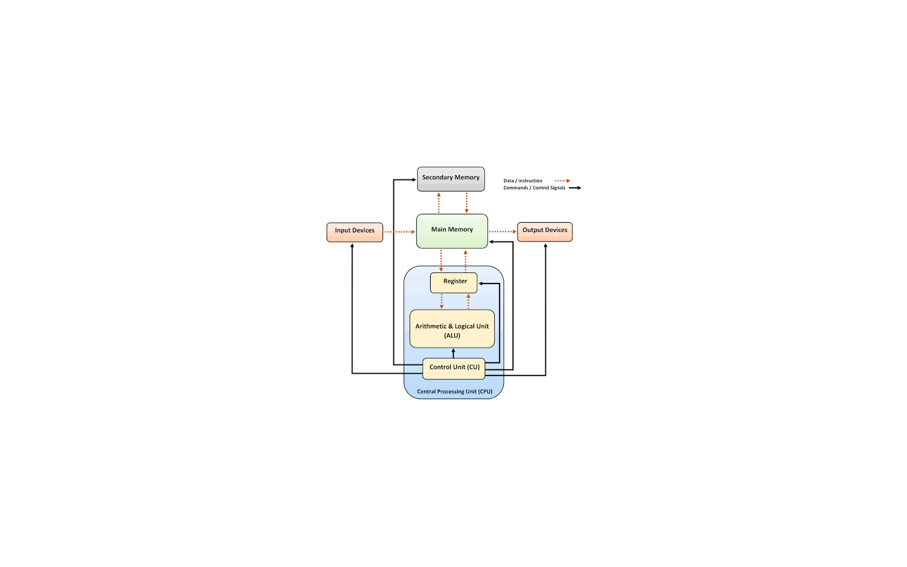

# MyPage_

COMPUTER SYSTEM · 10 CATEGORIES · 116 SUBCATEGORIES · 1 POST

## Latest

<table>
  <tr>
    <td rowspan="2" width="40%" valign="top">
      
    </td>
    <td width="60%" valign="top">
      PROGRAM EXECUTION FLOW · 2026.09.05 
      <strong>Compilation &amp; Interpretation (컴파일과 해석)</strong> 
      컴파일과 인터프리테이션의 차이부터 AOT, JIT, 현대 언어 실행 방식까지 정리했다.
    </td>
  </tr>
  <tr height="1">
    <td width="60%" height="1" valign="bottom">
      <strong><a href="./00-system-overview/02-program-execution-flow/compilation-interpretation/">글 읽기 →</a></strong>
    </td>
  </tr>
</table>

## Categories

<table>
  <tr>
    <td width="50%" valign="top">
      
       
      00 . 6 SUBCATEGORIES · 1 POST 
      <strong><a href="./00-system-overview/">00 . System Overview (시스템 전체 흐름)</a></strong>
    </td>
    <td width="50%" valign="top">
      
       
      01 . 11 SUBCATEGORIES · 0 POSTS 
      <strong><a href="./01-programming-execution/">01 . Programming &amp; Execution (프로그래밍과 실행)</a></strong>
    </td>
  </tr>
  <tr>
    <td width="50%" valign="top">
      
       
      02 . 9 SUBCATEGORIES · 0 POSTS 
      <strong><a href="./02-data-structures-algorithms/">02 . Data Structures &amp; Algorithms (자료구조와 알고리즘)</a></strong>
    </td>
    <td width="50%" valign="top">
      
       
      03 . 10 SUBCATEGORIES · 0 POSTS 
      <strong><a href="./03-computer-architecture/">03 . Computer Architecture (컴퓨터 구조)</a></strong>
    </td>
  </tr>
  <tr>
    <td width="50%" valign="top">
      
       
      04 . 13 SUBCATEGORIES · 0 POSTS 
      <strong><a href="./04-operating-systems/">04 . Operating Systems (운영체제)</a></strong>
    </td>
    <td width="50%" valign="top">
      
       
      05 . 14 SUBCATEGORIES · 0 POSTS 
      <strong><a href="./05-computer-networks/">05 . Computer Networks (컴퓨터 네트워크)</a></strong>
    </td>
  </tr>
  <tr>
    <td width="50%" valign="top">
      
       
      06 . 12 SUBCATEGORIES · 0 POSTS 
      <strong><a href="./06-storage-databases/">06 . Storage &amp; Databases (저장장치와 데이터베이스)</a></strong>
    </td>
    <td width="50%" valign="top">
      
       
      07 . 13 SUBCATEGORIES · 0 POSTS 
      <strong><a href="./07-distributed-systems/">07 . Distributed Systems (분산 시스템과 시스템 설계)</a></strong>
    </td>
  </tr>
  <tr>
    <td width="50%" valign="top">
      
       
      08 . 13 SUBCATEGORIES · 0 POSTS 
      <strong><a href="./08-software-engineering/">08 . Software Engineering (소프트웨어 공학과 운영)</a></strong>
    </td>
    <td width="50%" valign="top">
      
       
      09 . 15 SUBCATEGORIES · 0 POSTS 
      <strong><a href="./09-security-reliability/">09 . Security &amp; Reliability (보안과 안정성)</a></strong>
    </td>
  </tr>
</table>
